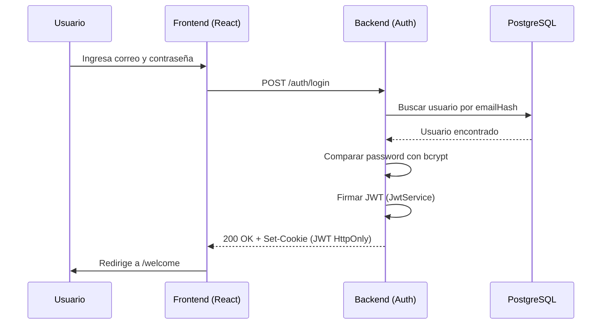
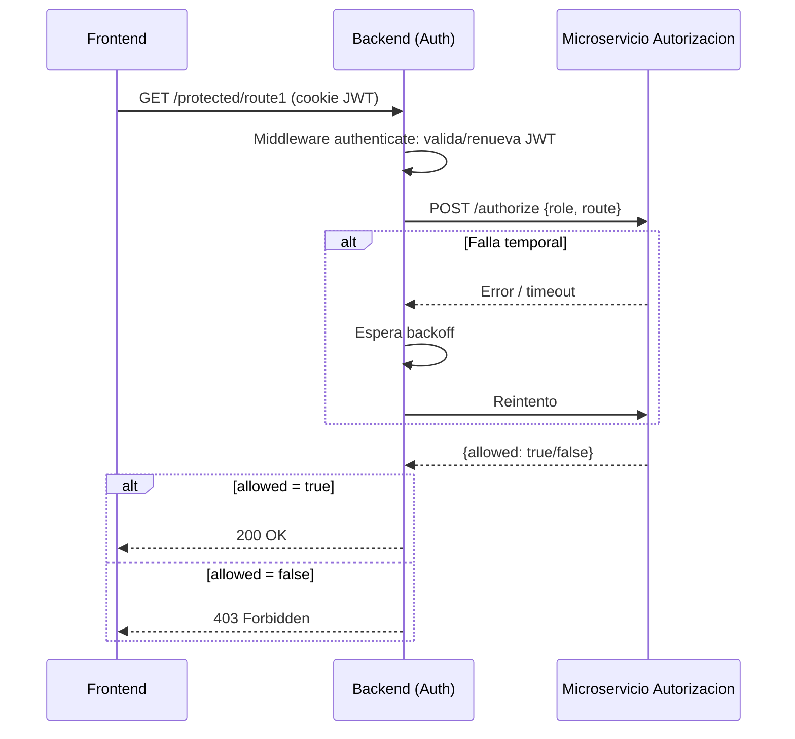
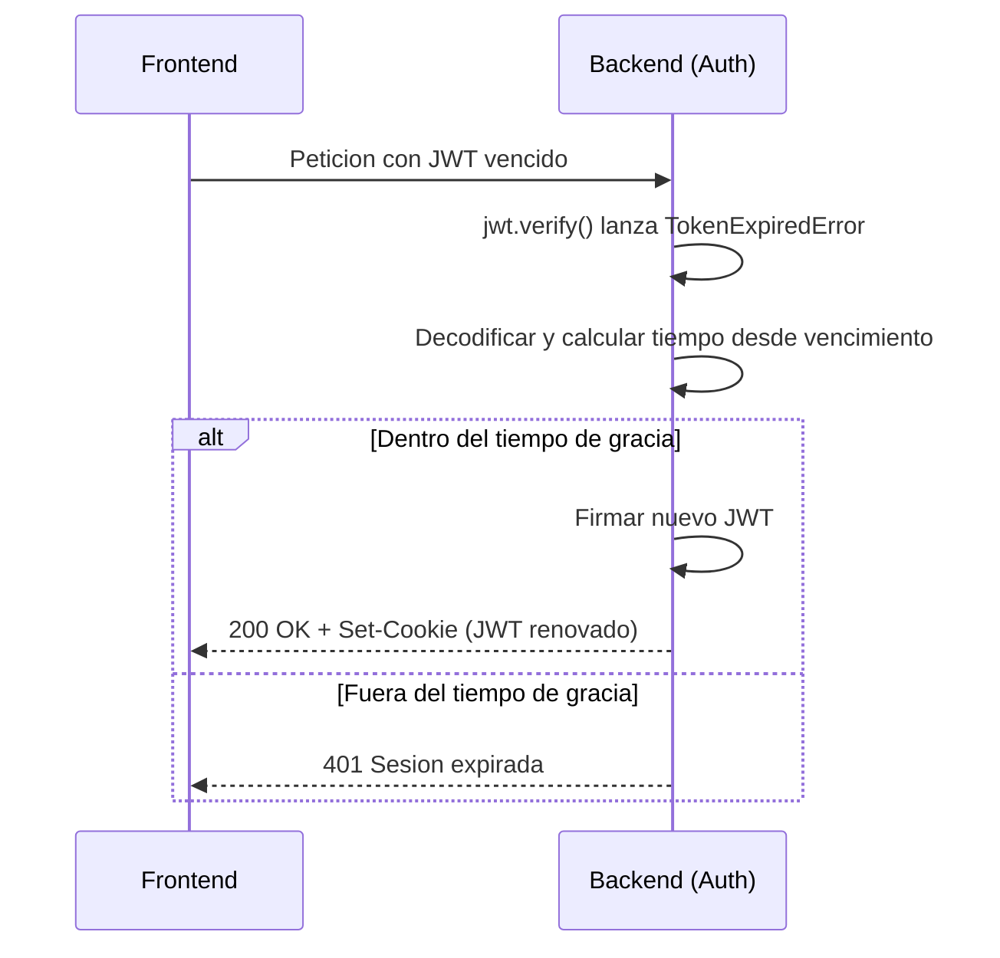

# Práctica 2 — Autenticación y Autorización

Módulo de registro, login y autorización por roles (Admin/Cliente), con JWT
en cookies HTTP-only, renovación automática, datos sensibles encriptados
con AES, y un microservicio de autorización independiente consultado
mediante un retry loop con backoff.

## Tecnologías utilizadas

| Capa | Tecnología | Ventajas | Desventajas |
|---|---|---|---|
| Backend | Node.js + Express + TypeScript | Tipado estático reduce errores en tiempo de desarrollo; ecosistema maduro; fácil de estructurar en capas | Rendimiento inferior a lenguajes compilados para cargas muy altas |
| Base de datos | PostgreSQL + Prisma ORM | Prisma da tipado automático sobre las consultas y migraciones versionadas; PostgreSQL es robusto y gratuito | Curva de aprendizaje de Prisma; migraciones requieren disciplina en equipo |
| Autenticación | JWT + cookies HTTP-only | Sin estado en el servidor (no requiere sesión en memoria/BD); HTTP-only mitiga robo de token vía XSS | El token no se puede invalidar antes de su expiración sin lista negra adicional |
| Encriptación | AES-256-CBC (Node `crypto`) | Estándar de la industria, reversible cuando se necesita mostrar el dato | Requiere manejar la llave de forma segura; el correo encriptado no es buscable directamente (se resuelve con hash HMAC aparte) |
| Frontend | React + TypeScript (Vite) | Tipado en el frontend también; Vite compila muy rápido en desarrollo | Más código que una solución sin framework para una app tan pequeña |
| Autorización | Microservicio independiente en Express | Desacopla la política de acceso del servicio de autenticación; se puede escalar/reemplazar por separado | Introduce latencia de red y un punto de falla adicional (mitigado con el retry loop) |

## Cómo ejecutar el proyecto

Se necesitan **3 procesos corriendo al mismo tiempo**, cada uno en su propia terminal.

### 1. Base de datos
Tener PostgreSQL corriendo localmente con una base de datos creada (ej. `p2auth`).

### 2. Microservicio de autorización
```bash
cd authz-service
npm install
# crear archivo .env (ver seccion de variables de entorno abajo)
npm run dev
```
Corre en `http://localhost:5000`.

### 3. Backend de autenticación
```bash
cd backend
npm install
# crear archivo .env (ver seccion de variables de entorno abajo)
npx prisma generate
npx prisma migrate dev --name init
npm run dev
```
Corre en `http://localhost:4000`.

### 4. Frontend
```bash
cd frontend
npm install
npm run dev
```
Corre en `http://localhost:5173`.

## Variables de entorno

### `backend/.env`
| Variable | Descripción |
|---|---|
| `DATABASE_URL` | Cadena de conexión a PostgreSQL |
| `PORT` | Puerto del backend (default 4000) |
| `FRONTEND_ORIGIN` | Origen permitido por CORS |
| `JWT_SECRET` | Llave para firmar el JWT |
| `JWT_EXPIRES_IN` | Tiempo de vida del JWT (ej. `15m`) |
| `JWT_REFRESH_GRACE` | Tiempo de gracia tras expirar en el que se renueva automáticamente (ej. `5m`) |
| `AES_SECRET_KEY` | Llave de 32 caracteres para AES-256 |
| `EMAIL_HASH_SECRET` | Secreto para el HMAC determinístico del correo |
| `AUTHZ_SERVICE_URL` | URL del microservicio de autorización |
| `AUTHZ_MAX_RETRIES` | Número máximo de reintentos hacia el microservicio |
| `AUTHZ_BACKOFF_BASE_MS` | Base en ms del backoff exponencial entre reintentos |

### `authz-service/.env`
| Variable | Descripción |
|---|---|
| `PORT` | Puerto del microservicio (default 5000) |
| `SIMULATE_FAILURE_RATE` | Probabilidad (0 a 1) de simular una falla temporal, usado solo para pruebas del retry loop |

## Principios SOLID aplicados

### S — Single Responsibility Principle (Responsabilidad Única)

Cada clase del backend tiene un solo motivo para cambiar. Por ejemplo,
`CryptoService` (`backend/src/services/CryptoService.ts`) solo sabe
cifrar/descifrar y generar hashes determinísticos — no sabe nada de HTTP,
de la base de datos, ni de JWT:

```typescript
export class CryptoService {
  encrypt(plainText: string): string { /* ... */ }
  decrypt(cipherText: string): string { /* ... */ }
  deterministicHash(value: string): string { /* ... */ }
}
```

De la misma forma, `AuthController` (`backend/src/controllers/AuthController.ts`)
solo traduce HTTP hacia `AuthService`, sin contener lógica de negocio —
si el negocio cambia, se modifica `AuthService`, no el controlador.

### O — Open/Closed Principle (Abierto/Cerrado)

La tabla de permisos del microservicio de autorización
(`authz-service/src/permissions.ts`) está definida como datos, no como
condicionales `if/else` anidados:

```typescript
const PERMISSIONS: Record<ProtectedRoute, Role[]> = {
  ROUTE_1: ["ADMIN"],
  ROUTE_2: ["ADMIN", "CLIENT"],
};
```

Si mañana se agrega una `ROUTE_3` o un nuevo rol, solo se agrega una
entrada a este mapa — no hay que modificar la función `isAllowed()` que
la consulta. El código está *cerrado* a modificación pero *abierto* a
extensión.

### L — Liskov Substitution Principle (Sustitución de Liskov)

`PrismaUserRepository` implementa la interfaz `IUserRepository`
(`backend/src/repositories/IUserRepository.ts`). En cualquier parte del
código donde se espera un `IUserRepository`, se puede sustituir por
cualquier otra implementación (por ejemplo, un repositorio en memoria
para pruebas) sin romper el comportamiento esperado, porque todas
cumplen el mismo contrato de métodos y tipos de retorno.

### I — Interface Segregation Principle (Segregación de Interfaces)

`IUserRepository` expone únicamente los 3 métodos que `AuthService`
realmente necesita (`findByEmailHash`, `findById`, `create`) — no se
mezclan ahí operaciones que no le corresponden a un repositorio de
usuarios (como reportes o estadísticas). Cada interfaz del proyecto es
pequeña y específica para quien la consume.

### D — Dependency Inversion Principle (Inversión de Dependencias)

`AuthService` (`backend/src/services/AuthService.ts`) no crea sus propias
dependencias ni conoce Prisma directamente — las recibe por constructor
como abstracciones:

```typescript
export class AuthService {
  constructor(
    private readonly userRepository: IUserRepository,
    private readonly crypto: CryptoService,
    private readonly passwords: PasswordService,
    private readonly jwt: JwtService
  ) {}
}
```

La conexión entre la abstracción (`IUserRepository`) y su implementación
concreta (`PrismaUserRepository`) ocurre en un único lugar, el
"composition root" (`backend/src/routes/auth.routes.ts`). Esto permite
cambiar de Prisma a otro ORM, o usar un repositorio falso en pruebas,
sin tocar `AuthService`.

## Diagrama de secuencia

### Login exitoso



### Acceso a ruta protegida (con retry al microservicio)



### Renovación automática del JWT

