# Documento de Solución Técnica — Sistema de Procesamiento de Transacciones Bancarias

Práctica 3, Software Avanzado — USAC. Este documento consolida en texto narrativo lo que hasta ahora vivía disperso en diagramas: integración con la Práctica 2, reglas de negocio, estrategia de almacenamiento de CSV, estrategia de logging, comunicación entre servicios, propuesta de API Gateway, y justificación de tecnologías y patrones. Cubre directamente los criterios de rúbrica **2.2** (Descripción de la solución) y **2.4** (Descripción técnica de tecnologías y patrones).

Fuente de diseño: todos los diagramas en `../diagrams/puml/` y el registro de decisiones ya validado en `../diagrams/DIAGRAM-CONSISTENCY-REPORT.md`. Este documento no redefine nada — cita y explica en prosa lo que los diagramas ya representan.

---

## 1. Integración con el módulo de autenticación de la Práctica 2

El enunciado exige un **OAuth corporativo** (token de 12h) "complementado con" el **módulo de autenticación de la Práctica 2**, que gestiona permisos y accesos. En el diseño, esto se traduce en una separación de responsabilidades de dos capas:

| Capa | Qué resuelve | Dónde |
|---|---|---|
| OAuth corporativo | *Quién es* el usuario (identidad, token de 12h) | API Gateway, en cada request |
| Módulo P2 (autorización) | *Qué puede hacer* ese usuario (rol, permiso por acción) | API Gateway (verificación genérica) **y** MS2 Approval Workflow (re-verificación específica) |

**Por qué dos verificaciones y no una sola.** El Gateway valida el permiso de forma genérica ("¿el usuario tiene rol CHECKER?") antes de enrutar la petición — esto rechaza rápido en el perímetro y protege a los microservicios de tráfico no autorizado. Pero una decisión de aprobación (Maker/Checker/Authorizer) muta el estado financiero del lote, así que `approval-workflow-service` (MS2) **vuelve a preguntarle a P2** inmediatamente antes de persistir cualquier paso (patrón *defense-in-depth*, ya documentado y aplicado en `escenario2-flujo-aprobacion.puml`). Si el Gateway tuviera un bug de enrutamiento o alguien hiciera un llamado interno directo a MS2 evitando el perímetro, la decisión seguiría sin poder registrarse sin el permiso correcto.

Lo que el módulo P2 **no** resuelve, porque es conocimiento específico de este dominio y no un permiso genérico de usuario: la regla de que un mismo usuario no puede aprobar dos pasos del mismo lote (segregación de funciones, RN-05). Esa regla vive exclusivamente en `SegregationOfDutiesPolicy` dentro de MS2 — P2 no tiene visibilidad del historial de aprobaciones de un lote específico, solo del catálogo de roles/permisos del usuario.

**Preguntas de validación anticipadas** (el enunciado no define un cuestionario formal para el criterio "preguntas teóricas" — ver ambigüedades pendientes — pero se anticipan aquí las preguntas más obvias sobre esta integración):

- *¿Qué pasa si el token expira a mitad del flujo de aprobación?* El Gateway rechaza la siguiente petición con 401 antes de llegar a MS2; el `ApprovalRequest` permanece sin cambios en el paso en que estaba (no hay estados intermedios corruptos, ver `flujo-aprobacion-maker-checker-authorizer.puml`).
- *¿Qué pasa si P2 no responde?* La transición se aborta de forma atómica (503/504), sin cambio de estado — comportamiento ya definido como caso de error en la especificación formal del flujo de aprobación (turno anterior de esta conversación, sección G "Casos de error").
- *¿P2 conoce la existencia de lotes/transacciones?* No. P2 solo resuelve `hasPermission(userId, rol, acción)`. No tiene ni necesita el modelo de datos de MS1/MS2 — es intencional, para no acoplar un módulo de identidad genérico a un dominio bancario específico.

---

## 2. Reglas de negocio y cómo se garantizan técnicamente

| Regla | Descripción | Componente responsable | Mecanismo técnico |
|---|---|---|---|
| RN-01 | Saldo disponible | MS1 (`TransactionValidationService`) | Llamada síncrona a `IAccountVerificationClient` antes de marcar la transacción como válida |
| RN-02 | Límites de transacción | MS1 (`TransactionValidationService`) | Config `BusinessRuleLimits` (por tipo y diario), evaluada por transacción |
| RN-03 | Cuentas válidas | MS1 (`TransactionValidationService`) | Mismo puerto `IAccountVerificationClient` (ver ambigüedad pendiente sobre este sistema) |
| RN-04 | Prevención de fraude | MS1 (`TransactionValidationService`) | Motor de reglas interno, marca `fraudFlag` en `TransactionRecord` |
| RN-05 | Segregación de funciones (3 usuarios distintos) | MS2 (`SegregationOfDutiesPolicy`) | Verificación en aplicación **+** constraint `UNIQUE(approval_request_id, user_id)` en BD (doble capa) |
| RN-06 | Envío al core solo tras aprobación completa | MS3 (`CoreSubmissionOrchestrator`) | Estructural: MS3 solo tiene como disparador el evento `BatchApproved`, no existe otro punto de entrada |
| RN-07 | Notificación solo tras aprobación completa | MS4 (`NotificationDispatchService`) | Estructural: mismo mecanismo que RN-06, disparo exclusivo por `BatchApproved` |
| RN-08 | Historial consultable con descarga | MS5 (`BatchHistoryProjector`) | Proyección CQRS que escucha *todos* los eventos del dominio (incluye rechazos y fallos, corregido en la revisión de consistencia) |

Ninguna regla de negocio depende de validación exclusivamente en el cliente/UI — todas están implementadas en el microservicio dueño del dato, de forma que no pueden evadirse llamando directamente a la API.

---

## 3. Estrategia de almacenamiento de archivos CSV

El enunciado permite Cloud Storage (AWS S3/GCP/Azure) o servidor FTP. **[Decisión de diseño]** se elige **AWS S3** (o equivalente compatible, ej. MinIO en on-premise) como mecanismo principal, con FTP documentado como alternativa válida si la institución ya tiene esa infraestructura — el diseño no depende de cuál se use porque `MS1` accede a través del puerto `IFileStorageClient`, no de un SDK específico.

**Ciclo de vida del archivo:**
1. El Maker sube el CSV vía `POST /batches`. MS1 calcula un `checksum` antes de aceptar la carga, para detectar reintentos duplicados (idempotencia — ver `escenario1-carga-validacion-csv.puml`).
2. El archivo crudo se almacena **sin modificar** (inmutable) en el bucket/carpeta, referenciado por `Batch.storageReference`. Nunca se sobrescribe.
3. El contenido parseado (filas individuales) se persiste estructurado en `BD Ingesta` (`TransactionRecord`), separado del archivo crudo — el archivo crudo es evidencia legal/auditoría, la data estructurada es lo que el sistema procesa.
4. Para la descarga desde el historial (RF-09), `MS5` no duplica el archivo: usa `IFileDownloadProxy` para generar una URL de descarga hacia el mismo objeto en S3 (o hace *streaming* proxy), evitando copiar datos sensibles innecesariamente entre servicios — decisión ya justificada en el modelo de datos (evitar duplicación de información sensible).

**Seguridad:** cifrado en reposo (server-side encryption del proveedor cloud) y URLs de descarga firmadas con expiración corta, no acceso público directo al bucket. **[Decisión de diseño, no exigida explícitamente por el enunciado pero estándar en banca.]**

**Retención:** el enunciado no especifica un período. **[Supuesto, a confirmar]** se propone una política de 5–7 años, alineada con retención regulatoria típica del sector bancario en Guatemala — debe confirmarse con la institución real si este diseño se llevara a producción.

---

## 4. Estrategia de logging centralizado

Responsable: `MS6 audit-logging-service`. Diseño ya formalizado en `ms6-audit-logging.puml`.

- **Qué se registra:** cada transición de estado relevante en cualquier microservicio (creación de lote, resultado de validación, cada paso de aprobación —incluyendo intentos denegados—, envío al core, notificación enviada/fallida), más accesos y errores de autenticación/autorización capturados en el API Gateway.
- **Cómo llega la información a MS6:** dos canales, no uno solo. (1) Todos los microservicios publican eventos de dominio al broker, y MS6 está suscrito a *todos* ellos (fan-out automático, sin que cada servicio tenga que saber que MS6 existe). (2) Además, cada servicio también emite logs directos a MS6 para eventos que no ameritan ser un evento de dominio completo (ej. `AccessDenied`, `SegregationOfDutiesViolation`) — ver flechas `..> MS6` en `arquitectura-general.puml`.
- **Redacción de datos sensibles:** antes de persistir cualquier entrada, `RedactionPolicy` remueve o enmascara números de cuenta y montos del cuerpo del log — MS6 nunca almacena en texto plano lo mismo que MS1/MS3/MS4 protegen en sus propias bases de datos. Esto es consistente con la clasificación de "datos sensibles" ya hecha en el modelo de datos.
- **Correlación:** cada entrada lleva un `correlationId` (el `batchId` del lote, propagado desde el Gateway a través de todas las llamadas REST y eventos), lo que permite reconstruir el recorrido completo de un lote a través de los 6 microservicios para una auditoría — responde directamente al requisito de "logging centralizado y auditable" del enunciado (no solo "registrar", sino poder *reconstruir* qué pasó).
- **Tecnología:** **[Decisión de diseño]** Elasticsearch/OpenSearch como motor de almacenamiento e indexado (`BD Auditoría`), por su capacidad de búsqueda full-text y agregación sobre grandes volúmenes de logs — el enunciado no exige una tecnología específica.
- **Consulta:** expuesta vía `GET /logs` y `GET /audit/batches/{id}`, enrutada por el Gateway y restringida a roles de auditor/administrador (no todos los usuarios deberían poder leer el log completo del sistema — **[Decisión de diseño]**, el enunciado no detalla este control de acceso específico).

---

## 5. Comunicación entre servicios

El enunciado permite REST y/o mensajería asíncrona. El diseño usa **ambos, deliberadamente, no como alternativas sino para propósitos distintos**:

| Tipo | Cuándo se usa | Ejemplos |
|---|---|---|
| **REST síncrono** | Cuando el llamador necesita una respuesta inmediata para continuar (interacción de usuario) o cuando un servicio necesita datos puntuales de otro en el momento | Gateway → todos los microservicios (rutas de usuario); MS3 → MS1 y MS4 → MS1 (consulta de transacciones/beneficiarios de un lote aprobado) |
| **Mensajería asíncrona (eventos)** | Cuando una acción de negocio debe desencadenar reacciones en varios servicios sin acoplarlos entre sí, y cuando el remitente no necesita saber quién consume el evento | Todo el ciclo de vida del lote: `BatchUploaded → BatchValidated → BatchApproved/Rejected → BatchSubmittedToCore/Failed → NotificationBatchProcessed` |

**Por qué no todo es síncrono:** si MS2, al aprobar un lote, tuviera que llamar síncronamente a MS3 y a MS4 y esperar respuesta de ambos, un fallo o lentitud en el proveedor de correo (externo) bloquearía o haría fallar la aprobación misma — acoplando la disponibilidad de un sistema no crítico (correo) a una operación crítica (aprobación bancaria). Con eventos, MS2 publica y termina; MS3 y MS4 procesan en paralelo, cada uno con su propia política de reintento, sin afectarse entre sí ni afectar a MS2.

**Por qué no todo es asíncrono:** las consultas de lectura (`GET /approvals/{id}`, `GET /history/batches`) necesitan responder de inmediato a un usuario esperando en pantalla — un evento asíncrono no tiene sentido ahí.

**Tecnología del broker:** **[Decisión de diseño]** Apache Kafka, elegido sobre RabbitMQ/NATS (también permitidos por el enunciado) porque: (1) permite *replay* de eventos, útil para reconstruir el read-model de MS5 si se detecta un bug en la proyección; (2) particionamiento por `batchId` garantiza orden de eventos dentro de un mismo lote (crítico: `ApprovalStepCompleted` no debe procesarse fuera de orden); (3) alto throughput, alineado con el problema original de la práctica (picos de carga en fin de mes/planillas masivas).

---

## 6. Propuesta de API Gateway

**Responsabilidades:**
- Punto único de entrada para todos los clientes (Maker/Checker/Authorizer y cualquier consumidor futuro).
- Terminación TLS.
- Validación de token OAuth (JWT) antes de enrutar.
- Verificación de permiso genérica contra P2 (coarse-grained).
- Enrutamiento hacia los 6 microservicios según la ruta solicitada (tabla de rutas ya definida en `arquitectura-general.puml`).
- *Rate limiting* — relevante porque el problema original de la práctica es un sistema que colapsa en picos de demanda; limitar tasa de carga de CSV por cliente protege a MS1 de saturación sin necesitar cambios en el propio servicio.
- Propagación de `correlationId` para trazabilidad end-to-end.

**Lo que el Gateway explícitamente NO hace:** lógica de negocio, persistencia de datos de dominio, ni decisiones de aprobación — todo eso vive en los microservicios. El Gateway es un componente de infraestructura, no de dominio.

**Tecnología:** **[Decisión de diseño]** Kong Gateway (o equivalente gestionado como AWS API Gateway), por soporte nativo de plugins de validación JWT/OAuth2 y *rate limiting* sin código custom — el enunciado no exige un producto específico, cualquier gateway con estas capacidades es válido.

---

## 7. Descripción técnica de tecnologías y patrones (criterio 2.4)

| Patrón / tecnología | Dónde se aplica | Justificación |
|---|---|---|
| **Database-per-service** | Los 6 microservicios | Requisito explícito del enunciado (3.3); aísla fallos y permite evolución de esquema independiente |
| **CQRS** | MS5 History Query | Separa la carga de lectura/auditoría de la escritura transaccional — ataca directamente la causa raíz del problema original (monolito lento por contención de lecturas y escrituras) |
| **Anti-Corruption Layer** | MS3 Core Bank Integration | Aísla al resto del sistema del protocolo/volatilidad de un sistema externo crítico fuera de nuestro control |
| **Defense-in-depth (autorización)** | Gateway + MS2 | Evita que un único punto de verificación sea el único control sobre una operación que mueve dinero |
| **Segregación de funciones (maker-checker-authorizer)** | MS2 | Requisito explícito del enunciado; implementado con doble capa (aplicación + constraint de BD) |
| **Event-driven architecture / Pub-Sub** | Backbone completo vía Kafka | Desacopla servicios con distinto perfil de carga y disponibilidad (ver sección 5) |
| **Circuit breaker + reintento con backoff** | MS3 → Core bancario externo | El core bancario es un sistema externo inestable/fuera de nuestro control; evita saturarlo y evita que su caída bloquee el resto del sistema |
| **Idempotencia** | MS1 (checksum de batch), MS3 (`UNIQUE(batchId)`), MS4 (`UNIQUE(batchId, email)`) | Los brokers de mensajería garantizan entrega *at-least-once*; sin idempotencia, un reintento duplicaría envíos al core o correos a clientes |
| **Transactional Outbox** *(recomendado, no aún detallado a nivel de implementación)* | Todos los microservicios que publican eventos | Evita el problema de "se guardó en BD pero el evento se perdió" |
| Apache Kafka | Backbone de eventos | Ver justificación completa en sección 5 |
| PostgreSQL | MS1, MS2, MS3, MS4 | Transaccionalidad ACID necesaria para datos financieros y de aprobación |
| Elasticsearch/OpenSearch | MS6 | Búsqueda e indexado eficiente sobre grandes volúmenes de logs |
| AWS S3 (o FTP alternativo) | Almacenamiento de CSV | Ver justificación completa en sección 3 |
| Kong Gateway | API Gateway | Ver justificación completa en sección 6 |
| Docker / Kubernetes | *(opcional, valorado por el enunciado, no desarrollado a detalle en esta fase de diseño)* | Empaquetado y orquestación independiente por microservicio, coherente con *database-per-service* |

---

## 8. Trazabilidad hacia la rúbrica

| Sección de este documento | Criterio de rúbrica que cubre |
|---|---|
| 1. Integración P2 | 2.2 Descripción de la solución (10 pts) |
| 2. Reglas de negocio | 2.3 Reflejo de las reglas de validación del negocio (10 pts) |
| 3–6. CSV, logging, comunicación, Gateway | 1.1 Calidad del diseño arquitectónico (parte de 20–25 pts) — completa lo que los diagramas muestran gráficamente pero no explican en prosa |
| 7. Tecnologías y patrones | 2.4 Descripción técnica de tecnologías y patrones (10 pts) |

---

## 9. Diagramas del sistema (Mermaid)

Versión Mermaid de todos los diagramas del proyecto, para verlos renderizados directamente en este documento (GitHub/GitLab/editores con soporte Mermaid) sin depender de PlantUML. La fuente autoritativa sigue siendo `../diagrams/puml/` y `../diagrams/er/` — esta sección es una transcripción fiel para consulta rápida, no una redefinición.

### 9.1 Diagramas de clases

**MS1 — transaction-ingestion-service**

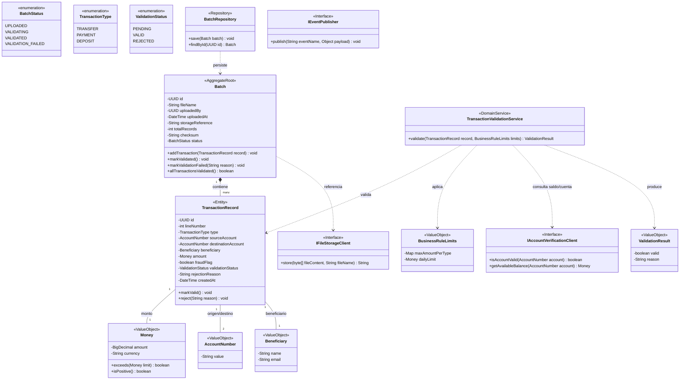
```mermaid
classDiagram
    class BatchStatus {
        <<enumeration>>
        UPLOADED
        VALIDATING
        VALIDATED
        VALIDATION_FAILED
    }
    class TransactionType {
        <<enumeration>>
        TRANSFER
        PAYMENT
        DEPOSIT
    }
    class ValidationStatus {
        <<enumeration>>
        PENDING
        VALID
        REJECTED
    }
    class Batch {
        <<AggregateRoot>>
        -UUID id
        -String fileName
        -UUID uploadedBy
        -DateTime uploadedAt
        -String storageReference
        -int totalRecords
        -String checksum
        -BatchStatus status
        +addTransaction(TransactionRecord record) void
        +markValidated() void
        +markValidationFailed(String reason) void
        +allTransactionsValidated() boolean
    }
    class TransactionRecord {
        <<Entity>>
        -UUID id
        -int lineNumber
        -TransactionType type
        -AccountNumber sourceAccount
        -AccountNumber destinationAccount
        -Beneficiary beneficiary
        -Money amount
        -boolean fraudFlag
        -ValidationStatus validationStatus
        -String rejectionReason
        -DateTime createdAt
        +markValid() void
        +reject(String reason) void
    }
    class Money {
        <<ValueObject>>
        -BigDecimal amount
        -String currency
        +exceeds(Money limit) boolean
        +isPositive() boolean
    }
    class AccountNumber {
        <<ValueObject>>
        -String value
    }
    class Beneficiary {
        <<ValueObject>>
        -String name
        -String email
    }
    class BusinessRuleLimits {
        <<ValueObject>>
        -Map maxAmountPerType
        -Money dailyLimit
    }
    class TransactionValidationService {
        <<DomainService>>
        +validate(TransactionRecord record, BusinessRuleLimits limits) ValidationResult
    }
    class ValidationResult {
        <<ValueObject>>
        -boolean valid
        -String reason
    }
    class BatchRepository {
        <<Repository>>
        +save(Batch batch) void
        +findById(UUID id) Batch
    }
    class IAccountVerificationClient {
        <<Interface>>
        +isAccountValid(AccountNumber account) boolean
        +getAvailableBalance(AccountNumber account) Money
    }
    class IFileStorageClient {
        <<Interface>>
        +store(byte[] fileContent, String fileName) String
    }
    class IEventPublisher {
        <<Interface>>
        +publish(String eventName, Object payload) void
    }

    Batch "1" *-- "many" TransactionRecord : contiene
    TransactionRecord "1" -- "1" Money : monto
    TransactionRecord "1" -- "2" AccountNumber : origen/destino
    TransactionRecord "1" -- "1" Beneficiary : beneficiario
    TransactionValidationService ..> TransactionRecord : valida
    TransactionValidationService ..> BusinessRuleLimits : aplica
    TransactionValidationService ..> IAccountVerificationClient : consulta saldo/cuenta
    TransactionValidationService ..> ValidationResult : produce
    Batch ..> IFileStorageClient : referencia
    BatchRepository ..> Batch : persiste
```

**MS2 — approval-workflow-service**

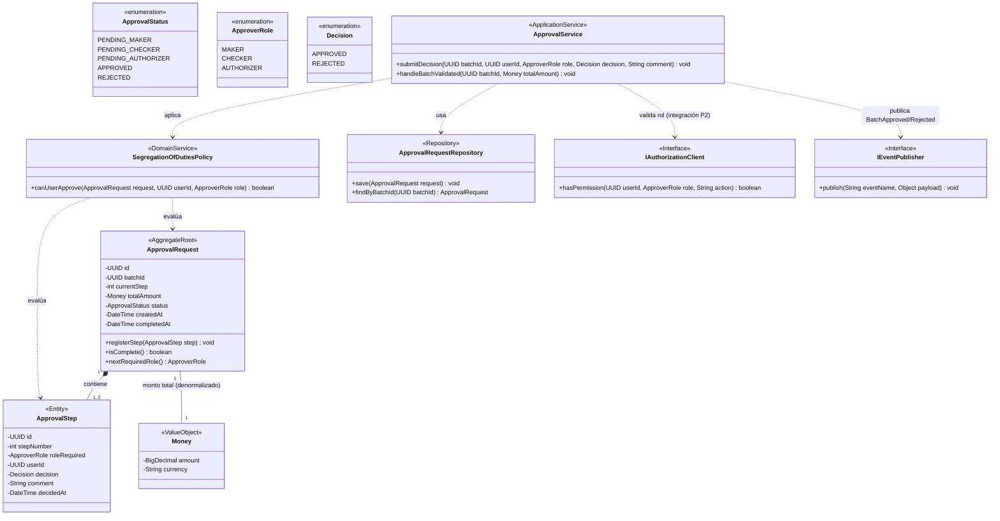
```mermaid
classDiagram
    class ApprovalStatus {
        <<enumeration>>
        PENDING_MAKER
        PENDING_CHECKER
        PENDING_AUTHORIZER
        APPROVED
        REJECTED
    }
    class ApproverRole {
        <<enumeration>>
        MAKER
        CHECKER
        AUTHORIZER
    }
    class Decision {
        <<enumeration>>
        APPROVED
        REJECTED
    }
    class ApprovalRequest {
        <<AggregateRoot>>
        -UUID id
        -UUID batchId
        -int currentStep
        -Money totalAmount
        -ApprovalStatus status
        -DateTime createdAt
        -DateTime completedAt
        +registerStep(ApprovalStep step) void
        +isComplete() boolean
        +nextRequiredRole() ApproverRole
    }
    class ApprovalStep {
        <<Entity>>
        -UUID id
        -int stepNumber
        -ApproverRole roleRequired
        -UUID userId
        -Decision decision
        -String comment
        -DateTime decidedAt
    }
    class Money {
        <<ValueObject>>
        -BigDecimal amount
        -String currency
    }
    class SegregationOfDutiesPolicy {
        <<DomainService>>
        +canUserApprove(ApprovalRequest request, UUID userId, ApproverRole role) boolean
    }
    class ApprovalService {
        <<ApplicationService>>
        +submitDecision(UUID batchId, UUID userId, ApproverRole role, Decision decision, String comment) void
        +handleBatchValidated(UUID batchId, Money totalAmount) void
    }
    class ApprovalRequestRepository {
        <<Repository>>
        +save(ApprovalRequest request) void
        +findByBatchId(UUID batchId) ApprovalRequest
    }
    class IAuthorizationClient {
        <<Interface>>
        +hasPermission(UUID userId, ApproverRole role, String action) boolean
    }
    class IEventPublisher {
        <<Interface>>
        +publish(String eventName, Object payload) void
    }

    ApprovalRequest "1" *-- "1..3" ApprovalStep : contiene
    ApprovalRequest "1" -- "1" Money : monto total (denormalizado)
    ApprovalService ..> ApprovalRequestRepository : usa
    ApprovalService ..> IAuthorizationClient : valida rol (integración P2)
    ApprovalService ..> SegregationOfDutiesPolicy : aplica
    ApprovalService ..> IEventPublisher : publica BatchApproved/Rejected
    SegregationOfDutiesPolicy ..> ApprovalRequest : evalúa
    SegregationOfDutiesPolicy ..> ApprovalStep : evalúa
```

**MS3 — core-bank-integration-service**

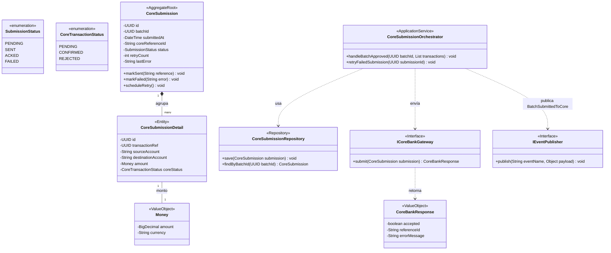
```mermaid
classDiagram
    class SubmissionStatus {
        <<enumeration>>
        PENDING
        SENT
        ACKED
        FAILED
    }
    class CoreTransactionStatus {
        <<enumeration>>
        PENDING
        CONFIRMED
        REJECTED
    }
    class CoreSubmission {
        <<AggregateRoot>>
        -UUID id
        -UUID batchId
        -DateTime submittedAt
        -String coreReferenceId
        -SubmissionStatus status
        -int retryCount
        -String lastError
        +markSent(String reference) void
        +markFailed(String error) void
        +scheduleRetry() void
    }
    class CoreSubmissionDetail {
        <<Entity>>
        -UUID id
        -UUID transactionRef
        -String sourceAccount
        -String destinationAccount
        -Money amount
        -CoreTransactionStatus coreStatus
    }
    class Money {
        <<ValueObject>>
        -BigDecimal amount
        -String currency
    }
    class CoreSubmissionOrchestrator {
        <<ApplicationService>>
        +handleBatchApproved(UUID batchId, List transactions) void
        +retryFailedSubmission(UUID submissionId) void
    }
    class CoreSubmissionRepository {
        <<Repository>>
        +save(CoreSubmission submission) void
        +findByBatchId(UUID batchId) CoreSubmission
    }
    class ICoreBankGateway {
        <<Interface>>
        +submit(CoreSubmission submission) CoreBankResponse
    }
    class CoreBankResponse {
        <<ValueObject>>
        -boolean accepted
        -String referenceId
        -String errorMessage
    }
    class IEventPublisher {
        <<Interface>>
        +publish(String eventName, Object payload) void
    }

    CoreSubmission "1" *-- "many" CoreSubmissionDetail : agrupa
    CoreSubmissionDetail "1" -- "1" Money : monto
    CoreSubmissionOrchestrator ..> CoreSubmissionRepository : usa
    CoreSubmissionOrchestrator ..> ICoreBankGateway : envía
    CoreSubmissionOrchestrator ..> IEventPublisher : publica BatchSubmittedToCore
    ICoreBankGateway ..> CoreBankResponse : retorna
```

**MS4 — notification-service**

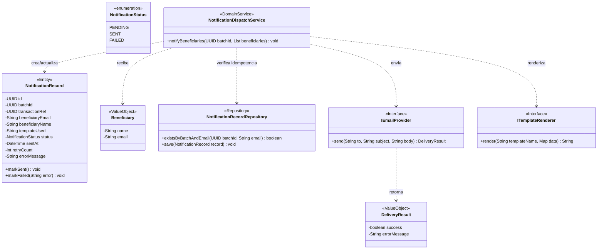
```mermaid
classDiagram
    class NotificationStatus {
        <<enumeration>>
        PENDING
        SENT
        FAILED
    }
    class NotificationRecord {
        <<Entity>>
        -UUID id
        -UUID batchId
        -UUID transactionRef
        -String beneficiaryEmail
        -String beneficiaryName
        -String templateUsed
        -NotificationStatus status
        -DateTime sentAt
        -int retryCount
        -String errorMessage
        +markSent() void
        +markFailed(String error) void
    }
    class NotificationDispatchService {
        <<DomainService>>
        +notifyBeneficiaries(UUID batchId, List beneficiaries) void
    }
    class Beneficiary {
        <<ValueObject>>
        -String name
        -String email
    }
    class NotificationRecordRepository {
        <<Repository>>
        +existsByBatchAndEmail(UUID batchId, String email) boolean
        +save(NotificationRecord record) void
    }
    class IEmailProvider {
        <<Interface>>
        +send(String to, String subject, String body) DeliveryResult
    }
    class ITemplateRenderer {
        <<Interface>>
        +render(String templateName, Map data) String
    }
    class DeliveryResult {
        <<ValueObject>>
        -boolean success
        -String errorMessage
    }

    NotificationDispatchService ..> Beneficiary : recibe
    NotificationDispatchService ..> NotificationRecordRepository : verifica idempotencia
    NotificationDispatchService ..> ITemplateRenderer : renderiza
    NotificationDispatchService ..> IEmailProvider : envía
    NotificationDispatchService ..> NotificationRecord : crea/actualiza
    IEmailProvider ..> DeliveryResult : retorna
```

**MS5 — history-query-service**

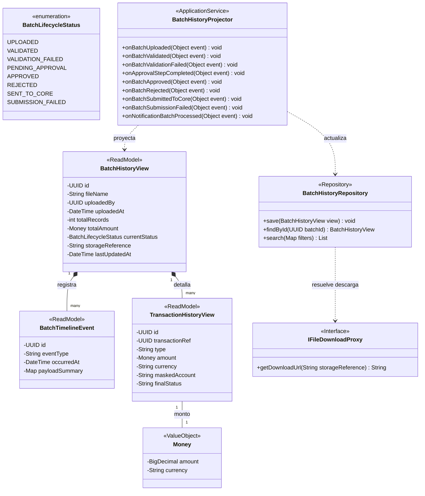
```mermaid
classDiagram
    class BatchLifecycleStatus {
        <<enumeration>>
        UPLOADED
        VALIDATED
        VALIDATION_FAILED
        PENDING_APPROVAL
        APPROVED
        REJECTED
        SENT_TO_CORE
        SUBMISSION_FAILED
    }
    class BatchHistoryView {
        <<ReadModel>>
        -UUID id
        -String fileName
        -UUID uploadedBy
        -DateTime uploadedAt
        -int totalRecords
        -Money totalAmount
        -BatchLifecycleStatus currentStatus
        -String storageReference
        -DateTime lastUpdatedAt
    }
    class BatchTimelineEvent {
        <<ReadModel>>
        -UUID id
        -String eventType
        -DateTime occurredAt
        -Map payloadSummary
    }
    class TransactionHistoryView {
        <<ReadModel>>
        -UUID id
        -UUID transactionRef
        -String type
        -Money amount
        -String currency
        -String maskedAccount
        -String finalStatus
    }
    class Money {
        <<ValueObject>>
        -BigDecimal amount
        -String currency
    }
    class BatchHistoryProjector {
        <<ApplicationService>>
        +onBatchUploaded(Object event) void
        +onBatchValidated(Object event) void
        +onBatchValidationFailed(Object event) void
        +onApprovalStepCompleted(Object event) void
        +onBatchApproved(Object event) void
        +onBatchRejected(Object event) void
        +onBatchSubmittedToCore(Object event) void
        +onBatchSubmissionFailed(Object event) void
        +onNotificationBatchProcessed(Object event) void
    }
    class BatchHistoryRepository {
        <<Repository>>
        +save(BatchHistoryView view) void
        +findById(UUID batchId) BatchHistoryView
        +search(Map filters) List
    }
    class IFileDownloadProxy {
        <<Interface>>
        +getDownloadUrl(String storageReference) String
    }

    BatchHistoryView "1" *-- "many" BatchTimelineEvent : registra
    BatchHistoryView "1" *-- "many" TransactionHistoryView : detalla
    TransactionHistoryView "1" -- "1" Money : monto
    BatchHistoryProjector ..> BatchHistoryRepository : actualiza
    BatchHistoryProjector ..> BatchHistoryView : proyecta
    BatchHistoryRepository ..> IFileDownloadProxy : resuelve descarga
```

**MS6 — audit-logging-service**

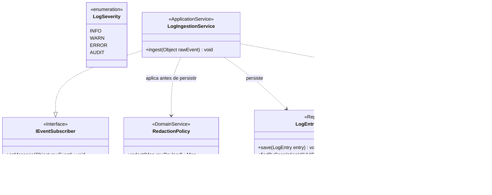
```mermaid
classDiagram
    class LogSeverity {
        <<enumeration>>
        INFO
        WARN
        ERROR
        AUDIT
    }
    class LogEntry {
        <<Entity>>
        -long id
        -UUID correlationId
        -String serviceName
        -String eventType
        -UUID userId
        -LogSeverity severity
        -String message
        -Map metadata
        -DateTime occurredAt
    }
    class RedactionPolicy {
        <<DomainService>>
        +redact(Map rawPayload) Map
    }
    class LogIngestionService {
        <<ApplicationService>>
        +ingest(Object rawEvent) void
    }
    class AuditQueryService {
        <<ApplicationService>>
        +findByCorrelationId(UUID correlationId) List
        +search(Map filters) List
    }
    class LogEntryRepository {
        <<Repository>>
        +save(LogEntry entry) void
        +findByCorrelationId(UUID correlationId) List
        +search(Map filters) List
    }
    class IEventSubscriber {
        <<Interface>>
        +onMessage(Object rawEvent) void
    }

    LogIngestionService ..|> IEventSubscriber
    LogIngestionService ..> RedactionPolicy : aplica antes de persistir
    LogIngestionService ..> LogEntryRepository : persiste
    LogIngestionService ..> LogEntry : crea
    AuditQueryService ..> LogEntryRepository : consulta
```

### 9.2 Diagramas de secuencia

**Escenario 1 — Carga y validación de CSV (RF-04, RF-05)**

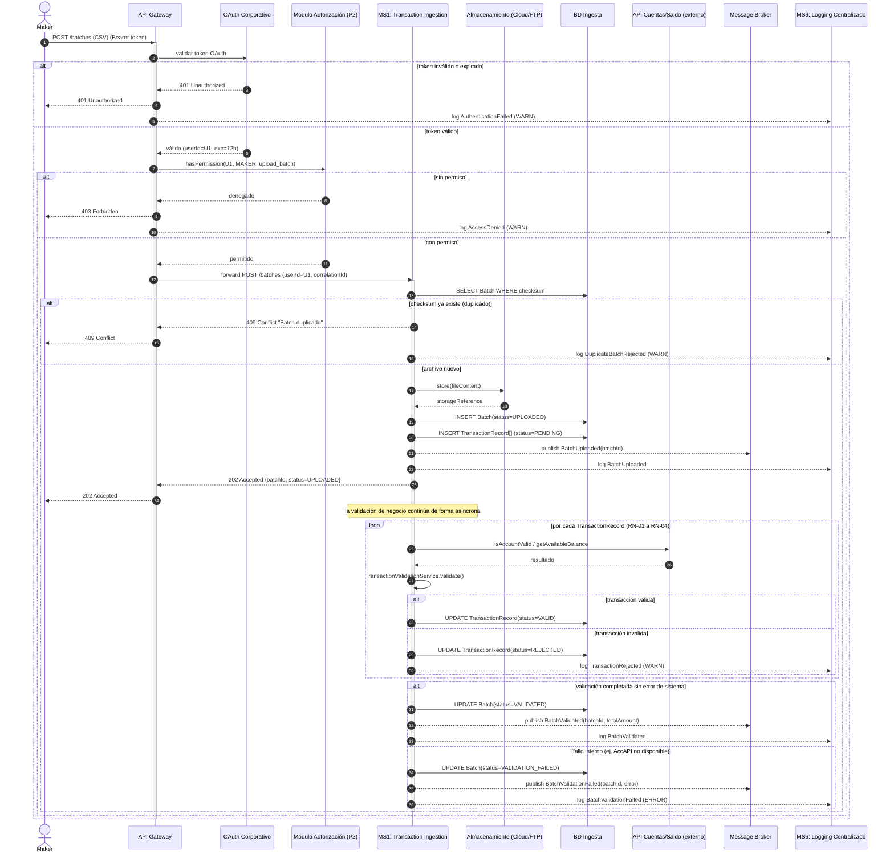
```mermaid
sequenceDiagram
    autonumber
    actor Maker
    participant GW as API Gateway
    participant OAuth as OAuth Corporativo
    participant P2 as Módulo Autorización (P2)
    participant MS1 as MS1: Transaction Ingestion
    participant Storage as Almacenamiento (Cloud/FTP)
    participant DB1 as BD Ingesta
    participant AccAPI as API Cuentas/Saldo (externo)
    participant MB as Message Broker
    participant MS6 as MS6: Logging Centralizado

    Maker->>GW: POST /batches (CSV) (Bearer token)
    activate GW
    GW->>OAuth: validar token OAuth
    alt token inválido o expirado
        OAuth-->>GW: 401 Unauthorized
        GW-->>Maker: 401 Unauthorized
        GW-->>MS6: log AuthenticationFailed (WARN)
    else token válido
        OAuth-->>GW: válido (userId=U1, exp=12h)
        GW->>P2: hasPermission(U1, MAKER, upload_batch)
        alt sin permiso
            P2-->>GW: denegado
            GW-->>Maker: 403 Forbidden
            GW-->>MS6: log AccessDenied (WARN)
        else con permiso
            P2-->>GW: permitido
            GW->>MS1: forward POST /batches (userId=U1, correlationId)
            activate MS1
            MS1->>DB1: SELECT Batch WHERE checksum
            alt checksum ya existe (duplicado)
                MS1-->>GW: 409 Conflict "Batch duplicado"
                GW-->>Maker: 409 Conflict
                MS1-->>MS6: log DuplicateBatchRejected (WARN)
            else archivo nuevo
                MS1->>Storage: store(fileContent)
                Storage-->>MS1: storageReference
                MS1->>DB1: INSERT Batch(status=UPLOADED)
                MS1->>DB1: INSERT TransactionRecord[] (status=PENDING)
                MS1-->>MB: publish BatchUploaded(batchId)
                MS1-->>MS6: log BatchUploaded
                MS1-->>GW: 202 Accepted {batchId, status=UPLOADED}
                GW-->>Maker: 202 Accepted
                note over MS1: la validación de negocio continúa de forma asíncrona
                loop por cada TransactionRecord (RN-01 a RN-04)
                    MS1->>AccAPI: isAccountValid / getAvailableBalance
                    AccAPI-->>MS1: resultado
                    MS1->>MS1: TransactionValidationService.validate()
                    alt transacción válida
                        MS1->>DB1: UPDATE TransactionRecord(status=VALID)
                    else transacción inválida
                        MS1->>DB1: UPDATE TransactionRecord(status=REJECTED)
                        MS1-->>MS6: log TransactionRejected (WARN)
                    end
                end
                alt validación completada sin error de sistema
                    MS1->>DB1: UPDATE Batch(status=VALIDATED)
                    MS1-->>MB: publish BatchValidated(batchId, totalAmount)
                    MS1-->>MS6: log BatchValidated
                else fallo interno (ej. AccAPI no disponible)
                    MS1->>DB1: UPDATE Batch(status=VALIDATION_FAILED)
                    MS1-->>MB: publish BatchValidationFailed(batchId, error)
                    MS1-->>MS6: log BatchValidationFailed (ERROR)
                end
            end
            deactivate MS1
        end
    end
    deactivate GW
```

**Escenario 2 — Flujo maker-checker-authorizer (defense-in-depth)**

```mermaid
sequenceDiagram
    autonumber
    actor Maker
    actor Checker
    actor Authorizer
    participant GW as API Gateway
    participant OAuth as OAuth Corporativo
    participant P2 as Módulo Autorización (P2)
    participant MS2 as MS2: Approval Workflow
    participant DB2 as BD Aprobación
    participant MB as Message Broker
    participant MS6 as MS6: Logging Centralizado

    note over GW,MS2: Defense-in-depth: el Gateway valida permiso genérico antes de enrutar; MS2 vuelve a verificar contra P2 antes de persistir cualquier decisión.

    rect rgb(240,240,240)
    note over MB,MS2: Creación automática de la solicitud (evento del Escenario 1)
    MB->>MS2: evento BatchValidated(batchId, totalAmount)
    activate MS2
    MS2->>DB2: INSERT ApprovalRequest(status=PENDING_MAKER, currentStep=0)
    MS2-->>MS6: log ApprovalRequestCreated
    deactivate MS2
    end

    rect rgb(240,240,240)
    note over Maker,MS6: Paso 1 — Maker envía el lote a aprobación
    Maker->>GW: POST /approvals/{batchId}/steps {role:MAKER, decision:APPROVED}
    activate GW
    GW->>OAuth: validar token
    OAuth-->>GW: válido (userId=U1)
    GW->>P2: hasPermission(U1, MAKER, submit_batch)
    P2-->>GW: permitido
    GW->>MS2: forward decisión (userId=U1)
    activate MS2
    MS2->>P2: hasPermission(U1, MAKER, submit_batch) [re-verificación]
    P2-->>MS2: permitido
    MS2->>DB2: SELECT ApprovalRequest WHERE batchId
    MS2->>MS2: SegregationOfDutiesPolicy.canUserApprove(U1, MAKER)
    MS2->>DB2: INSERT ApprovalStep(step=1, role=MAKER, decision=APPROVED)
    MS2->>DB2: UPDATE ApprovalRequest(status=PENDING_CHECKER, currentStep=1)
    MS2-->>MB: publish ApprovalStepCompleted(step=1)
    MS2-->>MS6: log StepApproved: MAKER por U1
    MS2-->>GW: 200 OK {status:PENDING_CHECKER}
    deactivate MS2
    GW-->>Maker: 200 OK
    deactivate GW
    end

    rect rgb(240,240,240)
    note over Checker,MS6: Paso 2 — Checker revisa y decide
    Checker->>GW: GET /approvals/{batchId}
    GW->>OAuth: validar token
    GW->>P2: hasPermission(U2, CHECKER, view_approval)
    GW->>MS2: forward consulta
    MS2->>DB2: SELECT detalle
    MS2-->>GW: detalle del lote
    GW-->>Checker: 200 OK

    Checker->>GW: POST /approvals/{batchId}/steps {role:CHECKER, decision}
    activate GW
    GW->>OAuth: validar token
    OAuth-->>GW: válido (userId=U2)
    GW->>P2: hasPermission(U2, CHECKER, review_batch)
    P2-->>GW: permitido
    GW->>MS2: forward decisión (userId=U2)
    activate MS2
    MS2->>P2: hasPermission(U2, CHECKER, review_batch) [re-verificación]
    P2-->>MS2: permitido
    MS2->>MS2: SegregationOfDutiesPolicy.canUserApprove(U2, CHECKER)
    alt U2 ya aprobó como MAKER (RN-05)
        MS2-->>GW: 409 Conflict "usuario ya participó"
        GW-->>Checker: 409 Conflict
        MS2-->>MS6: log SegregationOfDutiesViolation (WARN)
    else segregación válida
        alt decision == REJECTED
            MS2->>DB2: INSERT ApprovalStep(step=2, role=CHECKER, decision=REJECTED)
            MS2->>DB2: UPDATE ApprovalRequest(status=REJECTED, completedAt=now)
            MS2-->>MB: publish BatchRejected(batchId, reason)
            MS2-->>MS6: log BatchRejected por CHECKER
            MS2-->>GW: 200 OK {status:REJECTED}
        else decision == APPROVED
            MS2->>DB2: INSERT ApprovalStep(step=2, role=CHECKER, decision=APPROVED)
            MS2->>DB2: UPDATE ApprovalRequest(status=PENDING_AUTHORIZER, currentStep=2)
            MS2-->>MB: publish ApprovalStepCompleted(step=2)
            MS2-->>MS6: log StepApproved: CHECKER por U2
            MS2-->>GW: 200 OK {status:PENDING_AUTHORIZER}
        end
    end
    GW-->>Checker: respuesta
    deactivate MS2
    deactivate GW
    end

    rect rgb(240,240,240)
    note over Authorizer,MS6: Paso 3 — Authorizer revisa y aprueba/rechaza
    Authorizer->>GW: GET /approvals/{batchId}
    GW->>OAuth: validar token
    GW->>P2: hasPermission(U3, AUTHORIZER, view_approval)
    GW->>MS2: forward consulta
    MS2-->>GW: detalle del lote
    GW-->>Authorizer: 200 OK

    Authorizer->>GW: POST /approvals/{batchId}/steps {role:AUTHORIZER, decision}
    activate GW
    GW->>OAuth: validar token
    OAuth-->>GW: válido (userId=U3)
    GW->>P2: hasPermission(U3, AUTHORIZER, authorize_batch)
    P2-->>GW: permitido
    GW->>MS2: forward decisión (userId=U3)
    activate MS2
    MS2->>P2: hasPermission(U3, AUTHORIZER, authorize_batch) [re-verificación]
    P2-->>MS2: permitido
    MS2->>MS2: SegregationOfDutiesPolicy.canUserApprove(U3, AUTHORIZER)
    alt U3 ya participó antes (RN-05)
        MS2-->>GW: 409 Conflict
        GW-->>Authorizer: 409 Conflict
        MS2-->>MS6: log SegregationOfDutiesViolation (WARN)
    else segregación válida
        alt decision == REJECTED
            MS2->>DB2: INSERT ApprovalStep(step=3, role=AUTHORIZER, decision=REJECTED)
            MS2->>DB2: UPDATE ApprovalRequest(status=REJECTED, completedAt=now)
            MS2-->>MB: publish BatchRejected(batchId, reason)
            MS2-->>MS6: log BatchRejected por AUTHORIZER
            MS2-->>GW: 200 OK {status:REJECTED}
        else decision == APPROVED (tercera y última aprobación)
            MS2->>DB2: INSERT ApprovalStep(step=3, role=AUTHORIZER, decision=APPROVED)
            MS2->>DB2: UPDATE ApprovalRequest(status=APPROVED, completedAt=now)
            MS2-->>MB: publish BatchApproved(batchId, totalAmount)
            MS2-->>MS6: log BatchApproved - flujo completo (AUDIT)
            MS2-->>GW: 200 OK {status:APPROVED}
            note over MB: Fan-out asíncrono de BatchApproved hacia MS3, MS4 y MS5
        end
    end
    GW-->>Authorizer: respuesta
    deactivate MS2
    deactivate GW
    end
```

**Escenario 3 — Envío del lote aprobado al core bancario**

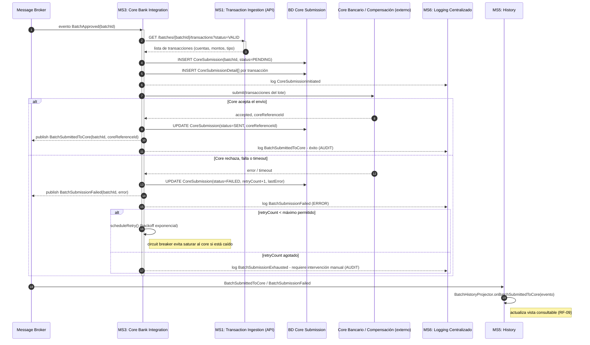
```mermaid
sequenceDiagram
    autonumber
    participant MB as Message Broker
    participant MS3 as MS3: Core Bank Integration
    participant MS1 as MS1: Transaction Ingestion (API)
    participant DB3 as BD Core Submission
    participant Core as Core Bancario / Compensación (externo)
    participant MS6 as MS6: Logging Centralizado
    participant MS5 as MS5: History

    MB->>MS3: evento BatchApproved(batchId)
    activate MS3
    MS3->>MS1: GET /batches/{batchId}/transactions?status=VALID
    activate MS1
    MS1-->>MS3: lista de transacciones (cuentas, montos, tipo)
    deactivate MS1

    MS3->>DB3: INSERT CoreSubmission(batchId, status=PENDING)
    MS3->>DB3: INSERT CoreSubmissionDetail[] por transacción
    MS3-->>MS6: log CoreSubmissionInitiated

    MS3->>Core: submit(transacciones del lote)
    alt Core acepta el envío
        Core-->>MS3: accepted, coreReferenceId
        MS3->>DB3: UPDATE CoreSubmission(status=SENT, coreReferenceId)
        MS3-->>MB: publish BatchSubmittedToCore(batchId, coreReferenceId)
        MS3-->>MS6: log BatchSubmittedToCore - éxito (AUDIT)
    else Core rechaza, falla o timeout
        Core-->>MS3: error / timeout
        MS3->>DB3: UPDATE CoreSubmission(status=FAILED, retryCount+1, lastError)
        MS3-->>MB: publish BatchSubmissionFailed(batchId, error)
        MS3-->>MS6: log BatchSubmissionFailed (ERROR)
        alt retryCount < máximo permitido
            MS3->>MS3: scheduleRetry() (backoff exponencial)
            note right of MS3: circuit breaker evita saturar al core si está caído
        else retryCount agotado
            MS3-->>MS6: log BatchSubmissionExhausted - requiere intervención manual (AUDIT)
        end
    end
    deactivate MS3

    MB->>MS5: BatchSubmittedToCore / BatchSubmissionFailed
    MS5->>MS5: BatchHistoryProjector.onBatchSubmittedToCore(evento)
    note right of MS5: actualiza vista consultable (RF-09)
```

**Escenario 4 — Notificación por correo a beneficiarios**

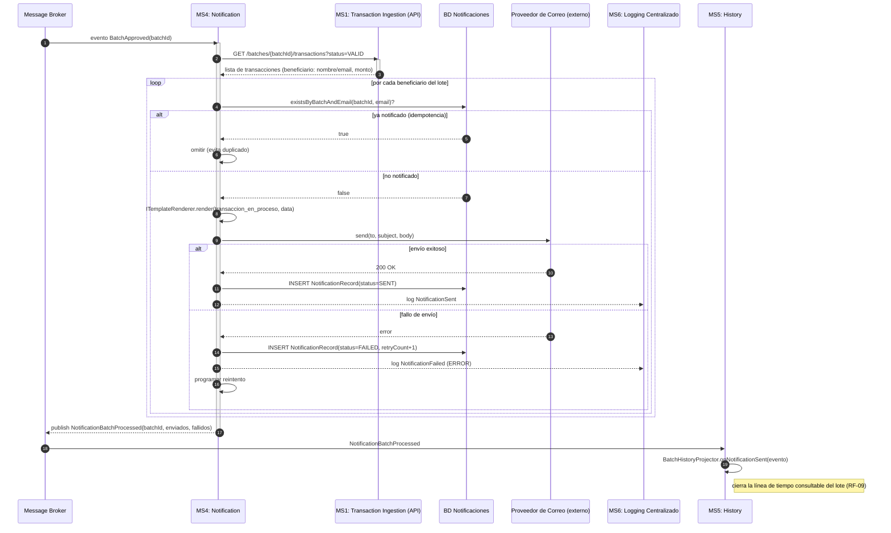
```mermaid
sequenceDiagram
    autonumber
    participant MB as Message Broker
    participant MS4 as MS4: Notification
    participant MS1 as MS1: Transaction Ingestion (API)
    participant DB4 as BD Notificaciones
    participant Mail as Proveedor de Correo (externo)
    participant MS6 as MS6: Logging Centralizado
    participant MS5 as MS5: History

    MB->>MS4: evento BatchApproved(batchId)
    activate MS4
    MS4->>MS1: GET /batches/{batchId}/transactions?status=VALID
    activate MS1
    MS1-->>MS4: lista de transacciones (beneficiario: nombre/email, monto)
    deactivate MS1

    loop por cada beneficiario del lote
        MS4->>DB4: existsByBatchAndEmail(batchId, email)?
        alt ya notificado (idempotencia)
            DB4-->>MS4: true
            MS4->>MS4: omitir (evita duplicado)
        else no notificado
            DB4-->>MS4: false
            MS4->>MS4: ITemplateRenderer.render(transaccion_en_proceso, data)
            MS4->>Mail: send(to, subject, body)
            alt envío exitoso
                Mail-->>MS4: 200 OK
                MS4->>DB4: INSERT NotificationRecord(status=SENT)
                MS4-->>MS6: log NotificationSent
            else fallo de envío
                Mail-->>MS4: error
                MS4->>DB4: INSERT NotificationRecord(status=FAILED, retryCount+1)
                MS4-->>MS6: log NotificationFailed (ERROR)
                MS4->>MS4: programar reintento
            end
        end
    end

    MS4-->>MB: publish NotificationBatchProcessed(batchId, enviados, fallidos)
    deactivate MS4
    MB->>MS5: NotificationBatchProcessed
    MS5->>MS5: BatchHistoryProjector.onNotificationSent(evento)
    note right of MS5: cierra la línea de tiempo consultable del lote (RF-09)
```

### 9.3 Diagrama de estados — `ApprovalRequest`

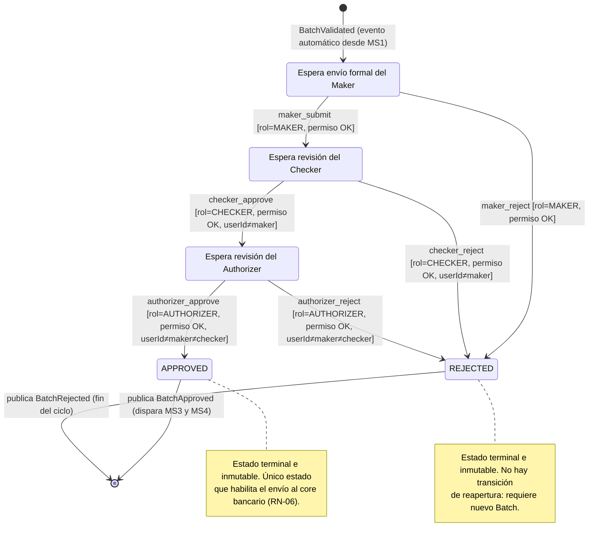
```mermaid
stateDiagram-v2
    [*] --> PENDING_MAKER: BatchValidated (evento automático desde MS1)
    PENDING_MAKER: Espera envío formal del Maker
    PENDING_CHECKER: Espera revisión del Checker
    PENDING_AUTHORIZER: Espera revisión del Authorizer

    PENDING_MAKER --> PENDING_CHECKER: maker_submit [rol=MAKER, permiso OK]
    PENDING_MAKER --> REJECTED: maker_reject [rol=MAKER, permiso OK]

    PENDING_CHECKER --> PENDING_AUTHORIZER: checker_approve [rol=CHECKER, permiso OK, userId≠maker]
    PENDING_CHECKER --> REJECTED: checker_reject [rol=CHECKER, permiso OK, userId≠maker]

    PENDING_AUTHORIZER --> APPROVED: authorizer_approve [rol=AUTHORIZER, permiso OK, userId≠maker≠checker]
    PENDING_AUTHORIZER --> REJECTED: authorizer_reject [rol=AUTHORIZER, permiso OK, userId≠maker≠checker]

    APPROVED --> [*]: publica BatchApproved (dispara MS3 y MS4)
    REJECTED --> [*]: publica BatchRejected (fin del ciclo)

    note right of APPROVED
        Estado terminal e inmutable. Único estado
        que habilita el envío al core bancario (RN-06).
    end note
    note right of REJECTED
        Estado terminal e inmutable. No hay transición
        de reapertura: requiere nuevo Batch.
    end note
```

Toda transición valida, antes de persistir: token OAuth (12h), permiso vía P2, y la regla de segregación de funciones propia de MS2 (RN-05, no delegable a P2).

### 9.4 Arquitectura general

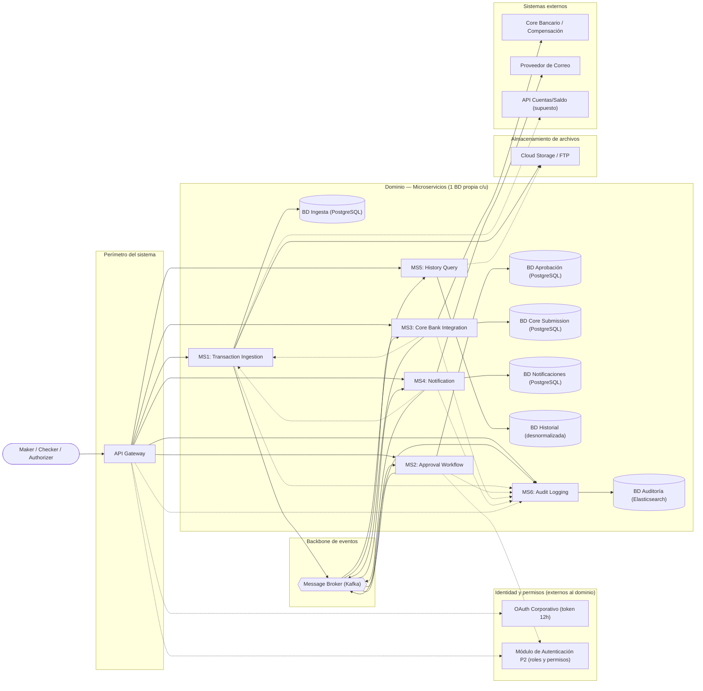
```mermaid
flowchart LR
    Usuarios(["Maker / Checker / Authorizer"])

    subgraph Perimetro["Perímetro del sistema"]
        GW["API Gateway"]
    end

    subgraph Identidad["Identidad y permisos (externos al dominio)"]
        OAuth["OAuth Corporativo (token 12h)"]
        P2["Módulo de Autenticación P2 (roles y permisos)"]
    end

    subgraph Dominio["Dominio — Microservicios (1 BD propia c/u)"]
        MS1["MS1: Transaction Ingestion"]
        DB1[("BD Ingesta (PostgreSQL)")]
        MS2["MS2: Approval Workflow"]
        DB2[("BD Aprobación (PostgreSQL)")]
        MS3["MS3: Core Bank Integration"]
        DB3[("BD Core Submission (PostgreSQL)")]
        MS4["MS4: Notification"]
        DB4[("BD Notificaciones (PostgreSQL)")]
        MS5["MS5: History Query"]
        DB5[("BD Historial (desnormalizada)")]
        MS6["MS6: Audit Logging"]
        DB6[("BD Auditoría (Elasticsearch)")]
    end

    subgraph Broker["Backbone de eventos"]
        MB{{"Message Broker (Kafka)"}}
    end

    subgraph Files["Almacenamiento de archivos"]
        Storage["Cloud Storage / FTP"]
    end

    subgraph Externos["Sistemas externos"]
        Core["Core Bancario / Compensación"]
        Mail["Proveedor de Correo"]
        AccAPI["API Cuentas/Saldo (supuesto)"]
    end

    Usuarios --> GW
    GW -.-> OAuth
    GW -.-> P2

    GW --> MS1
    GW --> MS2
    GW --> MS3
    GW --> MS4
    GW --> MS5
    GW --> MS6

    MS1 --> DB1
    MS2 --> DB2
    MS3 --> DB3
    MS4 --> DB4
    MS5 --> DB5
    MS6 --> DB6

    MS1 --> Storage
    MS1 -.-> AccAPI
    MS1 --> MB

    MB --> MS2
    MS2 -.-> P2
    MS2 --> MB

    MB --> MS3
    MS3 -.-> MS1
    MS3 --> Core
    MS3 --> MB

    MB --> MS4
    MS4 -.-> MS1
    MS4 --> Mail
    MS4 --> MB

    MB --> MS5
    MS5 -.-> Storage

    MB --> MS6
    MS1 -.-> MS6
    MS2 -.-> MS6
    MS3 -.-> MS6
    MS4 -.-> MS6
    GW -.-> MS6
```

Leyenda: flecha sólida (`-->`) = comunicación síncrona REST o persistencia propia; flecha punteada (`-.->`) = dependencia/evento asíncrono. Ningún microservicio accede a la BD de otro — toda información cruzada se obtiene por REST o evento.

### 9.5 Diagrama de componentes

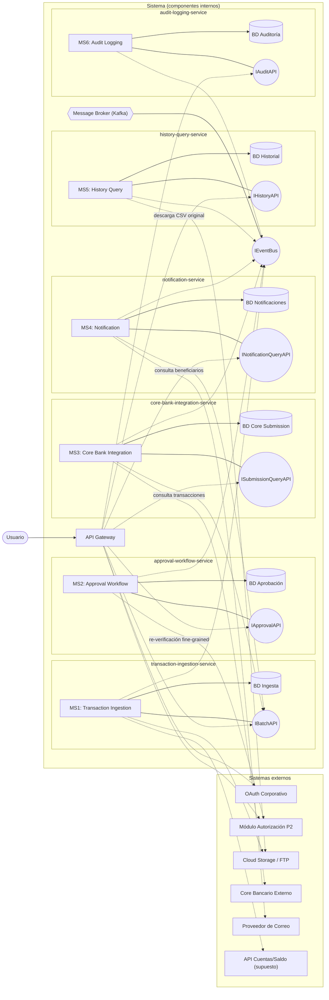
```mermaid
flowchart LR
    Usuario(["Usuario"])

    subgraph Sistema["Sistema (componentes internos)"]
        GW["API Gateway"]

        subgraph SVC1["transaction-ingestion-service"]
            MS1["MS1: Transaction Ingestion"]
            DB1[("BD Ingesta")]
            IBatchAPI(("IBatchAPI"))
        end

        subgraph SVC2["approval-workflow-service"]
            MS2["MS2: Approval Workflow"]
            DB2[("BD Aprobación")]
            IApprovalAPI(("IApprovalAPI"))
        end

        subgraph SVC3["core-bank-integration-service"]
            MS3["MS3: Core Bank Integration"]
            DB3[("BD Core Submission")]
            ISubmissionAPI(("ISubmissionQueryAPI"))
        end

        subgraph SVC4["notification-service"]
            MS4["MS4: Notification"]
            DB4[("BD Notificaciones")]
            INotifAPI(("INotificationQueryAPI"))
        end

        subgraph SVC5["history-query-service"]
            MS5["MS5: History Query"]
            DB5[("BD Historial")]
            IHistoryAPI(("IHistoryAPI"))
        end

        subgraph SVC6["audit-logging-service"]
            MS6["MS6: Audit Logging"]
            DB6[("BD Auditoría")]
            IAuditAPI(("IAuditAPI"))
        end

        MB{{"Message Broker (Kafka)"}}
        IEventBus(("IEventBus"))
    end

    subgraph Externos["Sistemas externos"]
        OAuth["OAuth Corporativo"]
        P2["Módulo Autorización P2"]
        Storage["Cloud Storage / FTP"]
        Core["Core Bancario Externo"]
        Mail["Proveedor de Correo"]
        AccAPI["API Cuentas/Saldo (supuesto)"]
    end

    MS1 --- IBatchAPI
    MS1 --> DB1
    MS2 --- IApprovalAPI
    MS2 --> DB2
    MS3 --- ISubmissionAPI
    MS3 --> DB3
    MS4 --- INotifAPI
    MS4 --> DB4
    MS5 --- IHistoryAPI
    MS5 --> DB5
    MS6 --- IAuditAPI
    MS6 --> DB6
    MB --- IEventBus

    Usuario --> GW
    GW -.-> OAuth
    GW -.-> P2
    GW -.-> IBatchAPI
    GW -.-> IApprovalAPI
    GW -.-> ISubmissionAPI
    GW -.-> INotifAPI
    GW -.-> IHistoryAPI
    GW -.-> IAuditAPI

    MS1 -.-> Storage
    MS1 -.-> AccAPI
    MS2 -.->|re-verificación fine-grained| P2
    MS3 -.-> Core
    MS4 -.-> Mail
    MS5 -.->|descarga CSV original| Storage

    MS3 -.->|consulta transacciones| IBatchAPI
    MS4 -.->|consulta beneficiarios| IBatchAPI

    MS1 -.-> IEventBus
    MS2 -.-> IEventBus
    MS3 -.-> IEventBus
    MS4 -.-> IEventBus
    MS5 -.-> IEventBus
    MS6 -.-> IEventBus
```

### 9.6 Modelos entidad-relación (ya en Mermaid en `../diagrams/er/`)

**MS1 — Batch / TransactionRecord**

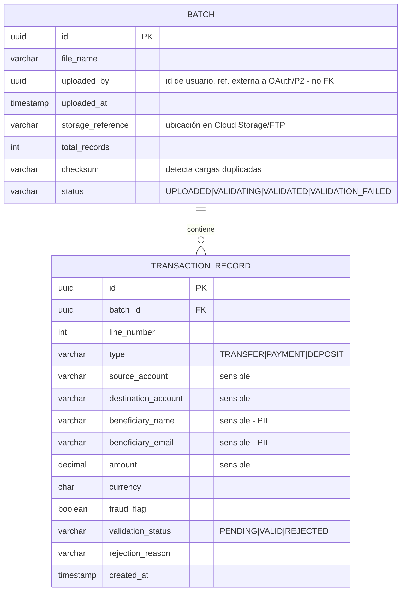
```mermaid
erDiagram
    BATCH ||--o{ TRANSACTION_RECORD : "contiene"
    BATCH {
        uuid id PK
        varchar file_name
        uuid uploaded_by "id de usuario, ref. externa a OAuth/P2 - no FK"
        timestamp uploaded_at
        varchar storage_reference "ubicación en Cloud Storage/FTP"
        int total_records
        varchar checksum "detecta cargas duplicadas"
        varchar status "UPLOADED|VALIDATING|VALIDATED|VALIDATION_FAILED"
    }
    TRANSACTION_RECORD {
        uuid id PK
        uuid batch_id FK
        int line_number
        varchar type "TRANSFER|PAYMENT|DEPOSIT"
        varchar source_account "sensible"
        varchar destination_account "sensible"
        varchar beneficiary_name "sensible - PII"
        varchar beneficiary_email "sensible - PII"
        decimal amount "sensible"
        char currency
        boolean fraud_flag
        varchar validation_status "PENDING|VALID|REJECTED"
        varchar rejection_reason
        timestamp created_at
    }
```

**MS2 — ApprovalRequest / ApprovalStep**

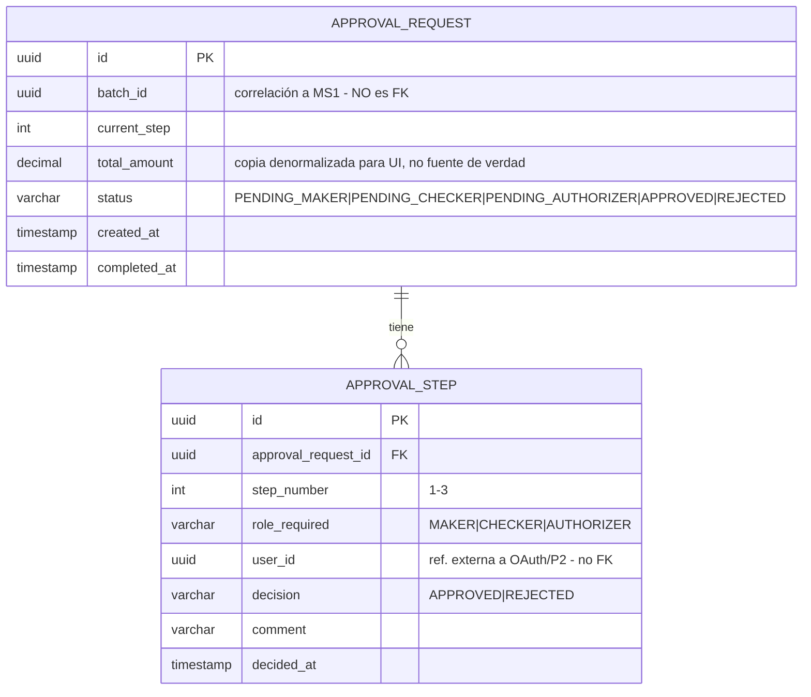
```mermaid
erDiagram
    APPROVAL_REQUEST ||--o{ APPROVAL_STEP : "tiene"
    APPROVAL_REQUEST {
        uuid id PK
        uuid batch_id "correlación a MS1 - NO es FK"
        int current_step
        decimal total_amount "copia denormalizada para UI, no fuente de verdad"
        varchar status "PENDING_MAKER|PENDING_CHECKER|PENDING_AUTHORIZER|APPROVED|REJECTED"
        timestamp created_at
        timestamp completed_at
    }
    APPROVAL_STEP {
        uuid id PK
        uuid approval_request_id FK
        int step_number "1-3"
        varchar role_required "MAKER|CHECKER|AUTHORIZER"
        uuid user_id "ref. externa a OAuth/P2 - no FK"
        varchar decision "APPROVED|REJECTED"
        varchar comment
        timestamp decided_at
    }
```

**MS3 — CoreSubmission / CoreSubmissionDetail**

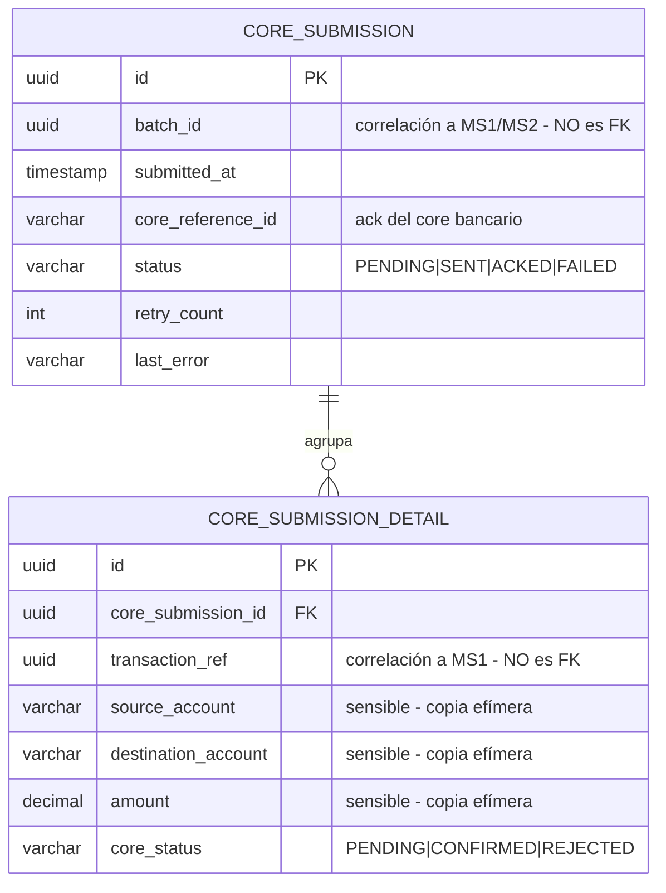
```mermaid
erDiagram
    CORE_SUBMISSION ||--o{ CORE_SUBMISSION_DETAIL : "agrupa"
    CORE_SUBMISSION {
        uuid id PK
        uuid batch_id "correlación a MS1/MS2 - NO es FK"
        timestamp submitted_at
        varchar core_reference_id "ack del core bancario"
        varchar status "PENDING|SENT|ACKED|FAILED"
        int retry_count
        varchar last_error
    }
    CORE_SUBMISSION_DETAIL {
        uuid id PK
        uuid core_submission_id FK
        uuid transaction_ref "correlación a MS1 - NO es FK"
        varchar source_account "sensible - copia efímera"
        varchar destination_account "sensible - copia efímera"
        decimal amount "sensible - copia efímera"
        varchar core_status "PENDING|CONFIRMED|REJECTED"
    }
```

**MS4 — NotificationRecord**

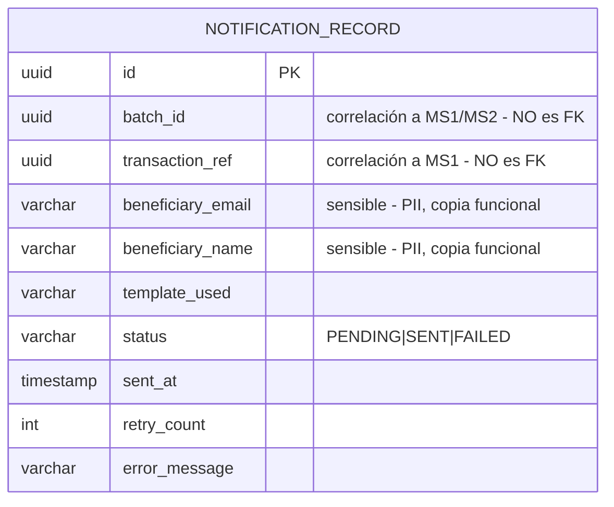
```mermaid
erDiagram
    NOTIFICATION_RECORD {
        uuid id PK
        uuid batch_id "correlación a MS1/MS2 - NO es FK"
        uuid transaction_ref "correlación a MS1 - NO es FK"
        varchar beneficiary_email "sensible - PII, copia funcional"
        varchar beneficiary_name "sensible - PII, copia funcional"
        varchar template_used
        varchar status "PENDING|SENT|FAILED"
        timestamp sent_at
        int retry_count
        varchar error_message
    }
```

**MS5 — BatchHistoryView / BatchTimelineEvent / TransactionHistoryView**

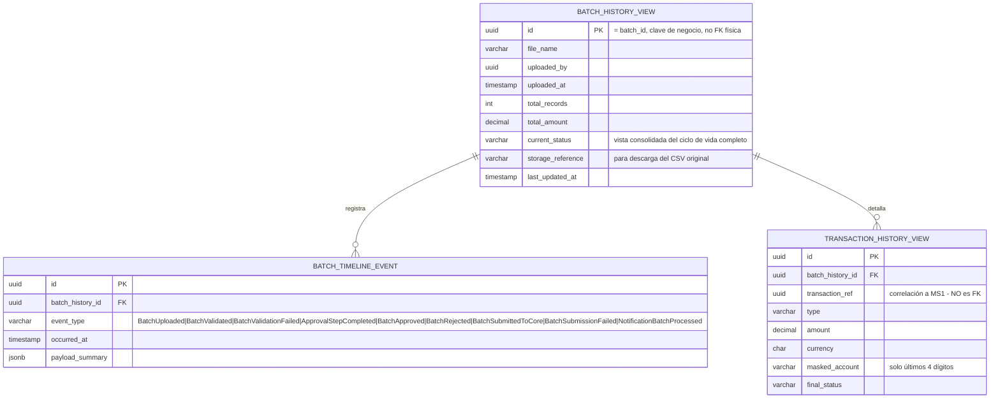
```mermaid
erDiagram
    BATCH_HISTORY_VIEW ||--o{ BATCH_TIMELINE_EVENT : "registra"
    BATCH_HISTORY_VIEW ||--o{ TRANSACTION_HISTORY_VIEW : "detalla"
    BATCH_HISTORY_VIEW {
        uuid id PK "= batch_id, clave de negocio, no FK física"
        varchar file_name
        uuid uploaded_by
        timestamp uploaded_at
        int total_records
        decimal total_amount
        varchar current_status "vista consolidada del ciclo de vida completo"
        varchar storage_reference "para descarga del CSV original"
        timestamp last_updated_at
    }
    BATCH_TIMELINE_EVENT {
        uuid id PK
        uuid batch_history_id FK
        varchar event_type "BatchUploaded|BatchValidated|BatchValidationFailed|ApprovalStepCompleted|BatchApproved|BatchRejected|BatchSubmittedToCore|BatchSubmissionFailed|NotificationBatchProcessed"
        timestamp occurred_at
        jsonb payload_summary
    }
    TRANSACTION_HISTORY_VIEW {
        uuid id PK
        uuid batch_history_id FK
        uuid transaction_ref "correlación a MS1 - NO es FK"
        varchar type
        decimal amount
        char currency
        varchar masked_account "solo últimos 4 dígitos"
        varchar final_status
    }
```

**MS6 — LogEntry**

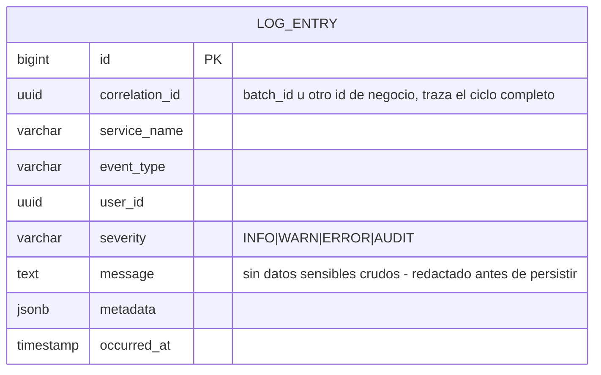
```mermaid
erDiagram
    LOG_ENTRY {
        bigint id PK
        uuid correlation_id "batch_id u otro id de negocio, traza el ciclo completo"
        varchar service_name
        varchar event_type
        uuid user_id
        varchar severity "INFO|WARN|ERROR|AUDIT"
        text message "sin datos sensibles crudos - redactado antes de persistir"
        jsonb metadata
        timestamp occurred_at
    }
```

---

