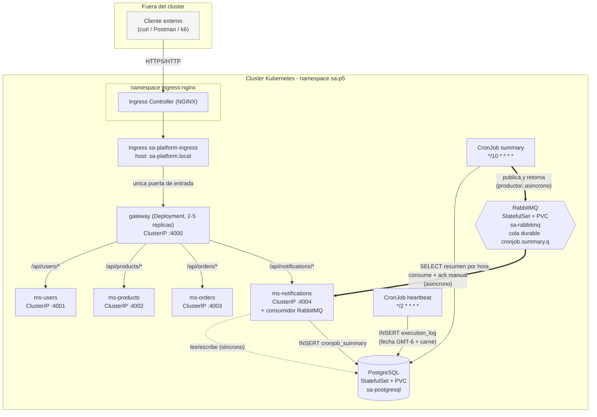

# Arquitectura

## Vision general

`sa-platform` empaqueta, como un unico chart de Helm, los 4 microservicios y
el API Gateway heredados de la Practica 4, mas 3 componentes nuevos para la
Practica 5: PostgreSQL (persistencia), RabbitMQ (mensajeria) y 2 CronJobs.
Todo vive dentro del namespace `sa-p5`, instalado con
`helm install ... --create-namespace` (ver [deployment.md](deployment.md)
sobre por que no se uso un template de `Namespace` propio dentro del chart).

## Diagrama

Vista de flujos (sincrono/asincrono, limites de NetworkPolicy):



Leyenda: flechas finas y azules = flujo **sincrono** HTTP (gateway -> MS,
MS -> DB). Flechas gruesas y rojas (`==>`) = flujo **asincrono** via
RabbitMQ (CronJob 2 publica y termina de inmediato; ms-notifications
consume de forma independiente, en otro momento).

## Elementos externos al cluster

- El cliente (navegador, curl, Postman, el propio script de k6).
- El Ingress Controller vive en su **propio namespace** (`ingress-nginx`),
  fuera de `sa-p5`, pero dentro del mismo cluster.

## Elementos internos al cluster (namespace `sa-p5`)

| Componente | Tipo de objeto | Expuesto como |
|---|---|---|
| gateway | Deployment (2-5 replicas, HPA) | ClusterIP (solo alcanzable desde el Ingress) |
| ms-users, ms-products, ms-orders, ms-notifications | Deployment (2-5 replicas, HPA) | ClusterIP (solo alcanzable desde gateway) |
| PostgreSQL (`sa-postgresql`) | StatefulSet + PVC + headless Service (dependencia Bitnami) | ClusterIP (solo alcanzable desde ms-notifications y los CronJobs) |
| RabbitMQ (`sa-rabbitmq`) | StatefulSet + PVC + headless Service (dependencia Bitnami) | ClusterIP (solo alcanzable desde ms-notifications y cronjob-summary) |
| cronjob-heartbeat, cronjob-summary | CronJob -> Job -> Pod (efimero) | No expone Service, solo se conecta hacia afuera |

Ningun componente interno usa `NodePort` ni `LoadBalancer`: el unico punto
de entrada externo es el Ingress -> gateway (ver [networking.md](networking.md)).

## Flujo sincrono tipico

```
Cliente -> Ingress -> gateway:4000 -> proxy HTTP -> ms-orders:4003 -> JSON
```

Identico al de la Practica 4 (`gateway/src/services/proxy.service.ts`), sin
cambios de logica de negocio: el Gateway sigue sin conocer reglas de
dominio, solo enruta.

## Flujo asincrono (obligatorio, seccion D + H)

1. `cronjob-summary` (Job efimero) calcula el resumen de ejecuciones por
   hora consultando `execution_log` en PostgreSQL.
2. Publica el resumen en la cola durable `cronjob.summary.q` de RabbitMQ y
   **termina inmediatamente** (no espera a que nadie lo consuma).
3. `ms-notifications` corre, en un hilo de fondo separado del servidor HTTP,
   un consumidor que escucha esa cola. Al recibir un mensaje, lo inserta en
   `cronjob_summary` (PostgreSQL) y **solo entonces** hace `ack`.
4. Si `ms-notifications` esta caido (o se escala a 0, o se reinicia), los
   mensajes se acumulan en la cola durable sin perderse; al volver, los
   procesa todos en orden (ver [async-messaging.md](async-messaging.md) para
   el procedimiento de evidencia).

## Limites impuestos por las NetworkPolicies

Ver el detalle completo en [networking.md](networking.md). Resumen:

- Namespace `ingress-nginx` -> `gateway`: permitido (unico originador externo).
- `gateway` -> cada microservicio: permitido, uno a uno.
- `ms-notifications`, `cronjob-heartbeat`, `cronjob-summary` -> PostgreSQL: permitido.
- `ms-notifications`, `cronjob-summary` -> RabbitMQ: permitido.
- Cualquier otro trafico lateral (por ejemplo `ms-users` -> `ms-orders`, o un
  pod cualquiera -> PostgreSQL) **no esta en ninguna regla de ingreso** y por
  lo tanto Kubernetes lo bloquea (con NetworkPolicies activas, el trafico de
  ingreso hacia un pod seleccionado por alguna policy es *deny-by-default*
  salvo lo explicitamente permitido).
