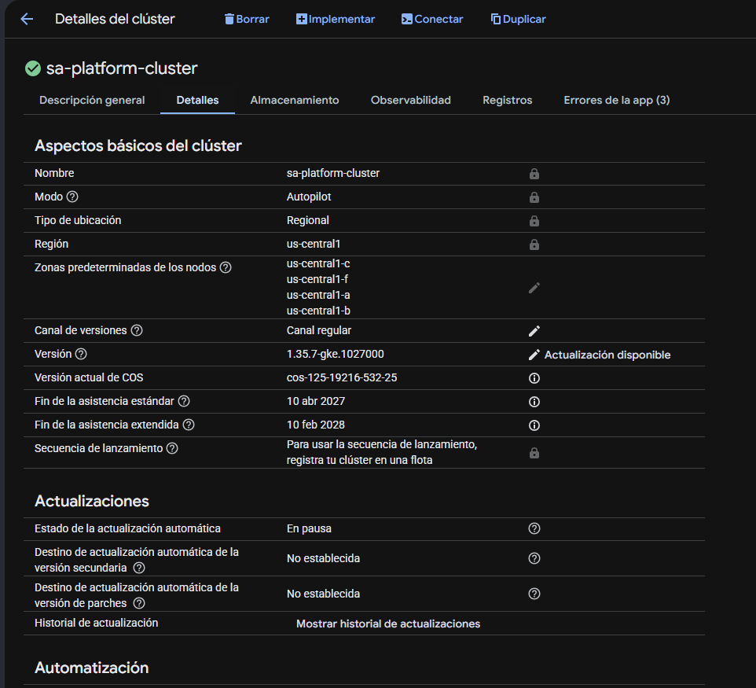
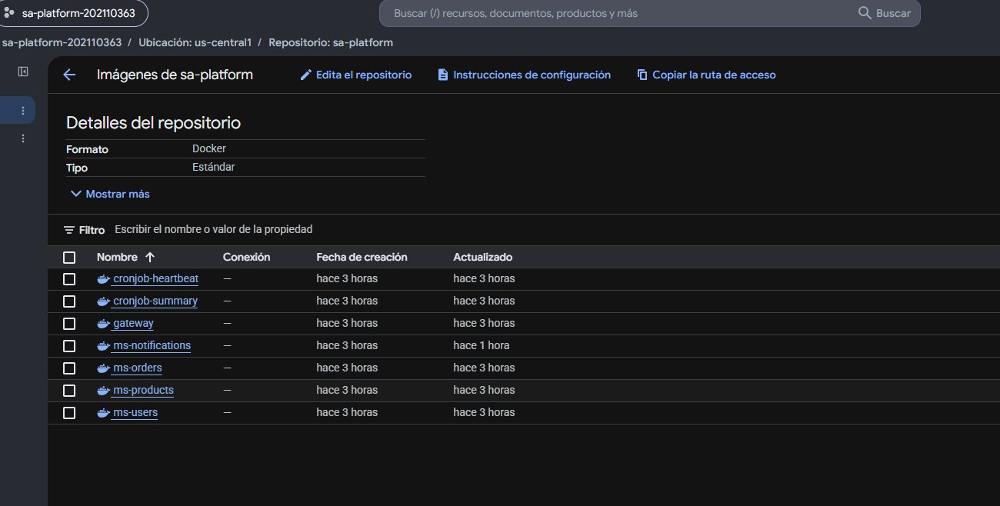

# Evidencias

Capturadas en una instalación real sobre **GKE Autopilot** (proyecto
`sa-platform-202110363`, clúster `sa-platform-cluster`, región
`us-central1`, namespace `sa-p5`), el 04-05/09/2026. Procedimiento completo
en [despliegue.md](despliegue.md).

> Este documento ya trae pegadas las salidas reales de terminal que
> obtuvimos durante el despliegue. Las secciones marcadas con
> `[PEGAR CAPTURA AQUI]` son las que **solo tú puedes tomar** (requieren
> abrir la consola web de GCP con tu sesión) — guarda el PNG en
> `P6/screenshots/` con el nombre sugerido y reemplaza la línea del
> placeholder por ``.

## 1. Clúster GKE (consola)



Consola de GCP → Kubernetes Engine → Clusters → `sa-platform-cluster` →
pestaña "Detalles". Se confirma: modo **Autopilot**, ubicación **Regional**,
región `us-central1`, clúster activo (ícono verde).

## 2. Nodos del clúster (mínimo 2)


```
$ kubectl get nodes
NAME                                           STATUS   ROLES    AGE    VERSION
gk3-sa-platform-cluster-pool-1-2970c278-tzpq   Ready    <none>   156m   v1.35.7-gke.1027000
gk3-sa-platform-cluster-pool-1-855ecb91-xltw   Ready    <none>   156m   v1.35.7-gke.1027000
gk3-sa-platform-cluster-pool-1-cd30629f-ctdx   Ready    <none>   120m   v1.35.7-gke.1027000
```

Autopilot escaló de 1 a 3 nodos automáticamente al desplegar la carga real
de la plataforma (ver [despliegue.md](despliegue.md)). Cumple el mínimo de
2 nodos exigido por la práctica, con la carga completa en ejecución (no un
clúster vacío).

## 3. Pods en ejecución

```
$ kubectl get pods -n sa-p5 -o wide
NAME                               READY   STATUS      RESTARTS   AGE
cronjob-heartbeat-29809868-kd5dw   0/1     Completed   0          4m34s
cronjob-heartbeat-29809870-pmj2w   0/1     Completed   0          2m34s
cronjob-heartbeat-29809872-xnpfd   0/1     Completed   0          34s
cronjob-summary-29809850-r8m2s     0/1     Completed   0          22m
cronjob-summary-29809860-mdrvm     0/1     Completed   0          12m
cronjob-summary-29809870-hbpmm     0/1     Completed   0          2m34s
gateway-658d66fb4b-b98rc           1/1     Running     0          147m
gateway-658d66fb4b-mj5vn           1/1     Running     0          147m
gateway-658d66fb4b-zcsrb           1/1     Running     0          147m
ms-notifications-b55548647-74lxv   1/1     Running     0          35m
ms-notifications-b55548647-h58pk   1/1     Running     0          35m
ms-orders-6b58cb66c-ssvnz          1/1     Running     0          147m
ms-orders-6b58cb66c-xcg45          1/1     Running     0          147m
ms-products-6c6c484f-gw9v2         1/1     Running     0          147m
ms-products-6c6c484f-l7gf2         1/1     Running     0          147m
ms-users-cb6ccccdc-2gljq           1/1     Running     0          147m
ms-users-cb6ccccdc-468pv           1/1     Running     0          147m
sa-postgresql-0                    1/1     Running     0          147m
sa-rabbitmq-0                      1/1     Running     0          40m
```

Los 10 pods de servicios (gateway 3, ms-users 2, ms-products 2, ms-orders 2,
ms-notifications 2) `Running`/`1/1`; PostgreSQL y RabbitMQ (StatefulSets)
`1/1`; ambos CronJobs terminan cada ejecución en `Completed` (no en `Error`).

```
$ kubectl get svc -n sa-p5
NAME                   TYPE        CLUSTER-IP       PORT(S)
gateway                ClusterIP   34.118.234.88    4000/TCP
ms-notifications       ClusterIP   34.118.225.111   4004/TCP
ms-orders              ClusterIP   34.118.232.224   4003/TCP
ms-products            ClusterIP   34.118.229.215   4002/TCP
ms-users               ClusterIP   34.118.235.58    4001/TCP
sa-postgresql          ClusterIP   34.118.237.203   5432/TCP
sa-rabbitmq            ClusterIP   34.118.231.79    5672/TCP,4369/TCP,25672/TCP,15672/TCP

$ kubectl get endpoints -n sa-p5
gateway                10.87.0.24:4000,10.87.0.73:4000,10.87.0.74:4000
ms-notifications       10.87.0.139:4004,10.87.0.92:4004
ms-orders              10.87.0.21:4003,10.87.0.70:4003
ms-products            10.87.0.22:4002,10.87.0.71:4002
ms-users               10.87.0.69:4001,10.87.0.75:4001
```

Todos los Services tienen Endpoints reales (IPs de Pods) detrás — no son
objetos "huérfanos" sin backend.

## 4. Registro de contenedores (consola)



Consola de GCP → Artifact Registry → repositorio `sa-platform`, región
`us-central1`. Se ven las 7 imágenes: `gateway`, `ms-users`, `ms-products`,
`ms-orders`, `ms-notifications`, `cronjob-heartbeat`, `cronjob-summary`.
`ms-notifications` muestra "Actualizado: hace 1 hora" — corresponde al
push de la versión `1.0.1` que corrigió el bug descrito en la sección 9.

```
$ gcloud artifacts docker images list us-central1-docker.pkg.dev/sa-platform-202110363/sa-platform --include-tags
IMAGE                  TAGS
.../gateway             1.0.0
.../ms-users            1.0.0
.../ms-products         1.0.0
.../ms-orders           1.0.0
.../ms-notifications    1.0.0, 1.0.1
.../cronjob-heartbeat   1.0.0
.../cronjob-summary     1.0.0
```

(`ms-notifications` tiene dos tags: `1.0.0` es la imagen original con el bug
de reconexión a PostgreSQL descrito en la sección 9; `1.0.1` es la corregida,
la que corre en producción — ver [despliegue.md](despliegue.md).)

## 5. Exposición pública (IP del LoadBalancer / Ingress)

```
$ kubectl get svc -n ingress-nginx ingress-nginx-controller
NAME                       TYPE           CLUSTER-IP       EXTERNAL-IP    PORT(S)
ingress-nginx-controller   LoadBalancer   34.118.234.151   34.170.206.2   80:30900/TCP,443:32368/TCP

$ kubectl get ingress -n sa-p5
NAME                  CLASS   HOSTS                 ADDRESS        PORTS
sa-platform-ingress   nginx   34.170.206.2.nip.io   34.170.206.2   80

$ nslookup 34.170.206.2.nip.io
Name:    34.170.206.2.nip.io
Address:  34.170.206.2
```

IP pública real: **`34.170.206.2`**, resuelta vía DNS público (`nip.io`,
sin necesidad de comprar un dominio ni editar `/etc/hosts`).

## 6. Peticiones exitosas desde internet

`[PEGAR CAPTURA AQUI: 06-navegador-publico.png]` (opcional: abre
`http://34.170.206.2.nip.io/health` en tu propio navegador, sin VPN ni red
de la universidad, y captura la respuesta)

```
$ curl http://34.170.206.2.nip.io/health
{"status":"ok","service":"gateway"}

$ curl http://34.170.206.2.nip.io/api/orders/orders
[{"id":1,"userId":1,"product":"Teclado mecanico","quantity":1,"status":"pending"},
 {"id":2,"userId":2,"product":"Mouse inalambrico","quantity":2,"status":"shipped"},
 {"id":3,"userId":3,"product":"Monitor 24 pulgadas","quantity":1,"status":"delivered"}]

$ curl -s -o /dev/null -w "HTTP %{http_code}\n" http://34.170.206.2.nip.io/api/users/health
HTTP 200
$ curl -s -o /dev/null -w "HTTP %{http_code}\n" http://34.170.206.2.nip.io/api/products/health
HTTP 200
$ curl -s -o /dev/null -w "HTTP %{http_code}\n" http://34.170.206.2.nip.io/api/notifications/health
HTTP 200

$ curl -s -o /dev/null -w "HTTP %{http_code}\n" http://34.170.206.2.nip.io/api/no-existe
HTTP 404
```

Las 5 rutas reales responden `200`; una ruta inexistente responde `404`
real del Gateway (no timeout ni 502) — confirma que el tráfico llega hasta
la aplicación, no solo hasta el balanceador.

## 7. Almacenamiento persistente

```
$ kubectl get pvc -n sa-p5
NAME                   STATUS   VOLUME       CAPACITY   ACCESS MODES   STORAGECLASS
data-sa-postgresql-0   Bound    pvc-ed4b...  2Gi        RWO            standard-rwo
data-sa-rabbitmq-0     Bound    pvc-97c1...  2Gi        RWO            standard-rwo

$ kubectl get storageclass
NAME                      PROVISIONER              RECLAIMPOLICY
standard-rwo (default)    pd.csi.storage.gke.io    Delete
```

Ambos PVC en `Bound`, usando `standard-rwo` (Persistent Disk balanceado),
la StorageClass por defecto de GKE — el chart no la fija explícitamente,
la toma automáticamente del clúster.

## 8. Secrets gestionados fuera del repositorio

```
$ kubectl get secrets -n sa-p5
NAME                                TYPE                 DATA
sa-platform-broker-credentials      Opaque               1
sa-platform-db-credentials          Opaque               1
sa-postgresql                       Opaque               2
sa-rabbitmq                         Opaque               2
sa-rabbitmq-config                  Opaque               1
sh.helm.release.v1.sa-platform.v1   helm.sh/release.v1   1

$ git add --dry-run P6/
add 'P6/.gitignore'
add 'P6/0780_Practica_6_2S2026.pdf'
add 'P6/helm/values-gke.yaml'
(P6/helm/values-secrets.yaml NO aparece: esta cubierto por P6/.gitignore)
```

Las contraseñas reales viven únicamente en `P6/helm/values-secrets.yaml`
(generado localmente con contraseñas aleatorias de 32 caracteres, nunca
impreso ni versionado); Kubernetes las expone a los Pods como `Secret`,
nunca como texto plano en el chart.

## 9. Comunicación asíncrona (CronJob → RabbitMQ → ms-notifications → PostgreSQL)

Pipeline completo verificado extremo a extremo — y con un incidente real
que documentamos honestamente porque fue justo lo que la práctica busca
enseñar (diferencias entre entorno local y productivo):

**El bug:** el hilo consumidor de `ms-notifications` (`summary_consumer.py`)
solo intentaba conectar a PostgreSQL **una vez**, sin reintentos. En GKE, el
primer arranque de PostgreSQL (adjuntar el disco persistente + `initdb`)
tardó más que en minikube local; el intento de conexión hizo timeout a los
10s y el hilo murió para siempre, sin loguear nada (el logging de Python no
estaba configurado). Mientras tanto, `cronjob-summary` siguió publicando un
mensaje cada 10 minutos, y **RabbitMQ los acumuló sin perder ninguno**
(cola durable) — la resiliencia del diseño funcionó incluso con el
consumidor caído:

```
$ kubectl exec sa-rabbitmq-0 -n sa-p5 -- rabbitmqctl list_queues name messages consumers
name                    messages  consumers
cronjob.summary.q       1         0        <- consumidor caido, mensaje acumulado
```

**La corrección** ([despliegue.md](despliegue.md)): reintentos con backoff
en la conexión a PostgreSQL + logging configurado, reconstruido como
`ms-notifications:1.0.1`, publicado en Artifact Registry y desplegado con
`helm upgrade`. Al reconectar, procesó **todo el backlog acumulado, en
orden**:

```
$ kubectl logs ms-notifications-b55548647-74lxv -n sa-p5
INFO:ms-notifications.summary_consumer:Consumidor escuchando en la cola 'cronjob.summary.q'
INFO:ms-notifications.summary_consumer:cronjob_summary: mensaje procesado y confirmado ({'generated_at': '2026-09-04T22:50:10...', ...})
INFO:ms-notifications.summary_consumer:cronjob_summary: mensaje procesado y confirmado ({'generated_at': '2026-09-04T23:00:11...', ...})
... (9 mensajes mas, uno por cada ejecucion del CronJob mientras el consumidor estuvo caido)

$ kubectl exec sa-rabbitmq-0 -n sa-p5 -- rabbitmqctl list_queues name messages consumers
name                    messages  consumers
cronjob.summary.q       0         2        <- backlog drenado, 2 replicas conectadas

$ kubectl exec sa-postgresql-0 -n sa-p5 -- psql -U sa_app -d sa_platform -c "SELECT count(*) FROM cronjob_summary;"
 count
-------
    11
```

11 filas persistidas en PostgreSQL: ningún mensaje se perdió pese a la
caída completa y prolongada del consumidor.

## 10. Extra: aislamiento de red con NetworkPolicy (funciona en la nube)

En P5, el bloqueo por NetworkPolicy **no se pudo verificar** en minikube
local (limitación documentada del CNI anidado en Windows/WSL2). En GKE
Autopilot (Dataplane V2 / Cilium) sí se aplica de verdad:

```
$ kubectl run intruder --restart=Never -n sa-p5 --image=busybox:1.36 \
    --labels="app=intruder" --command -- sh -c '...'
$ kubectl logs intruder -n sa-p5
--- intentando PostgreSQL ---
wget: error getting response
--- intentando RabbitMQ ---
wget: error getting response: Connection reset by peer
--- intentando ms-orders ---
wget: download timed out
```

Los 3 intentos, desde un pod sin las etiquetas autorizadas, **fallan**.
Control positivo, desde un pod SI autorizado:

```
$ kubectl exec deploy/ms-notifications -n sa-p5 -- python3 -c \
    "import socket; socket.create_connection(('sa-postgresql.sa-p5.svc.cluster.local',5432),timeout=4); print('CONECTADO')"
CONECTADO
$ kubectl exec deploy/ms-notifications -n sa-p5 -- python3 -c \
    "import socket; socket.create_connection(('sa-rabbitmq.sa-p5.svc.cluster.local',5672),timeout=4); print('CONECTADO')"
CONECTADO
```

Confirma que las NetworkPolicies del chart están correctamente
configuradas: el problema en P5 era una limitación del entorno local, no del
diseño.
