# Diagrama del pipeline CI/CD — Practica 7

Nombres reales de jobs, workflows e imagenes (ver
[.github/workflows/ci.yml](../../.github/workflows/ci.yml) y
[.github/workflows/cd.yml](../../.github/workflows/cd.yml)).

```mermaid
flowchart TD
    Dev["Developer\n(git push / PR)"] --> GH["GitHub\n(rama master u otra)"]
    GH --> Trigger{"Evento"}

    Trigger -->|"push (cualquier rama)\no pull_request -> master"| CI

    subgraph CI["Workflow: CI (.github/workflows/ci.yml)"]
        direction TB
        Checkout["actions/checkout"] --> Install["Install\nnpm ci / pip install"]
        Install --> Build["Build\ntsc (gateway, ms-users, ms-products)"]
        Build --> Test["Test\njest (Node) + pytest (Python)"]
        Test --> DockerValidate["docker-validate\ndocker build --push=false\n(7 imagenes)"]
    end

    DockerValidate --> IsMaster{"push a master?"}
    IsMaster -->|no, PR o rama feature| StopCI["Fin: solo feedback de CI"]
    IsMaster -->|si| DockerPush

    subgraph Push["job: docker-build-push (solo push a master)"]
        DockerPush["docker/build-push-action\nlogin GHCR con GITHUB_TOKEN"] --> GHCR[("GitHub Container Registry\nghcr.io/emileon9/sa-platform/&lt;svc&gt;:&lt;sha&gt; / :latest")]
    end

    GHCR --> WR["evento workflow_run\n(CI = success, branch = master)"]

    subgraph CD["Workflow: CD (.github/workflows/cd.yml)"]
        direction TB
        WR --> SelfHosted["runner self-hosted\n(PC del estudiante)"]
        SelfHosted --> HelmDep["helm dependency build\n(postgresql + rabbitmq)"]
        HelmDep --> HelmUpgrade["helm upgrade --install sa-platform\n-f values-dev.yaml -f P7/helm/values-ci.yaml\n-f values-secrets.yaml (local)\n--set *.image.tag=&lt;sha&gt;"]
        HelmUpgrade --> Rollout["kubectl rollout status\ndeployment/gateway, ms-users,\nms-products, ms-orders, ms-notifications"]
        Rollout --> Verify["kubectl get pods / deployments / cronjobs\n(evidencia + deteccion de fallo)"]
    end

    Verify --> K8s[("Cluster Kubernetes local\n(Docker Desktop / minikube)\nnamespace sa-p5")]

    K8s --> Micro["Microservicios en ejecucion\ngateway -> ms-users / ms-products / ms-orders / ms-notifications\n+ cronjob-heartbeat / cronjob-summary"]
```

## Fases mostradas

1. **Developer** hace `git push` o abre un Pull Request contra `master`.
2. **GitHub** dispara el workflow `CI` segun el evento.
3. **Build**: `npm run build` (tsc) para `gateway`, `ms-users`, `ms-products`.
4. **Test**: `npm test` (Jest + Supertest) y `pytest` (FastAPI TestClient) para
   los 5 microservicios.
5. **Docker Build (validacion)**: se construyen las 7 imagenes
   (`gateway`, `ms-users`, `ms-products`, `ms-orders`, `ms-notifications`,
   `cronjob-heartbeat`, `cronjob-summary`) sin publicarlas, en cada push y
   PR, para detectar Dockerfiles rotos antes de llegar a `master`.
6. **Docker Push**: solo si el evento es un push directo a `master`, las
   mismas 7 imagenes se reconstruyen, se etiquetan con el SHA del commit y
   `latest`, y se publican en GHCR.
7. **Kubernetes Deploy**: el workflow `CD` se dispara automaticamente al
   terminar `CI` en exito sobre `master`, corre en el runner self-hosted del
   estudiante, y aplica `helm upgrade --install` sobre el chart
   `sa-platform` con las imagenes recien publicadas.
8. **Verificacion**: `kubectl rollout status` por cada Deployment y
   `kubectl get pods` como evidencia final.
