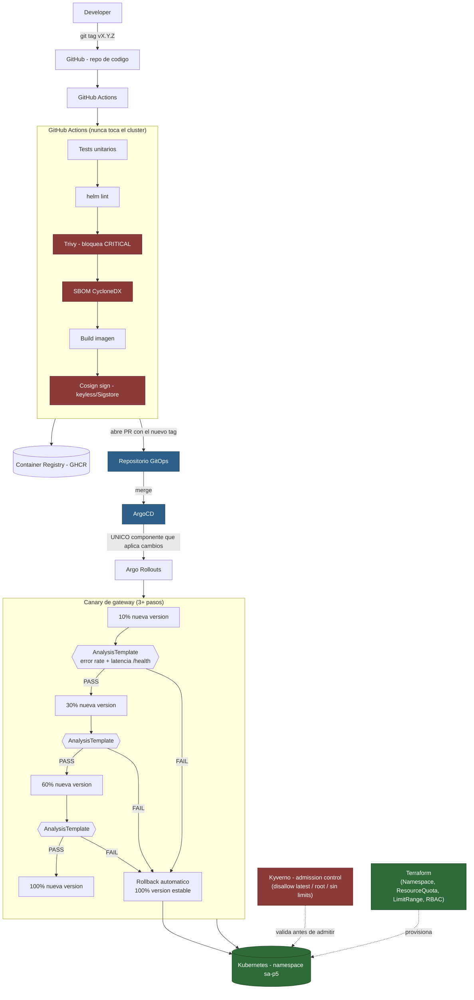

# Diagrama del flujo GitOps + entrega progresiva — Práctica 8

## Dónde ocurre cada cosa

| Pregunta | Respuesta |
|---|---|
| ¿Dónde se valida? | `helm lint` + Trivy (bloquea CRITICAL) + SBOM + firma, todo en GitHub Actions, antes de que exista un PR al repo GitOps. Luego, `AnalysisTemplate` en cada paso del canary, en vivo dentro del clúster. |
| ¿Quién aplica cambios al clúster? | **Únicamente ArgoCD.** Ningún workflow de GitHub Actions ejecuta `kubectl`/`helm`/`terraform` contra el clúster (ver `P8/docs/GITOPS.md`). |
| ¿Dónde ocurre la promoción? | Dentro de Argo Rollouts, paso a paso (`setWeight: 10 → 30 → 60 → 100`), cada uno gateado por el mismo `AnalysisTemplate`. |
| ¿Dónde ocurre el rollback? | Automático, dentro de Argo Rollouts: si un `AnalysisRun` falla, el Rollout revierte el peso al 100% de la versión estable sin intervención manual (ver `P8/docs/INCIDENT.md`). |
| ¿Dónde se aplica seguridad de supply chain? | Trivy + SBOM + Cosign en el pipeline de GitHub Actions (antes de publicar la imagen); Kyverno como admission controller dentro del clúster (rechaza en el momento de creación del recurso, independientemente de por dónde haya llegado el manifiesto). |
| ¿Quién administra namespace/cuotas/RBAC? | Terraform (`P8/terraform`), fuera del ciclo de vida de las aplicaciones — se aplica una sola vez (o cuando cambia la infraestructura de plataforma), no en cada release. |
