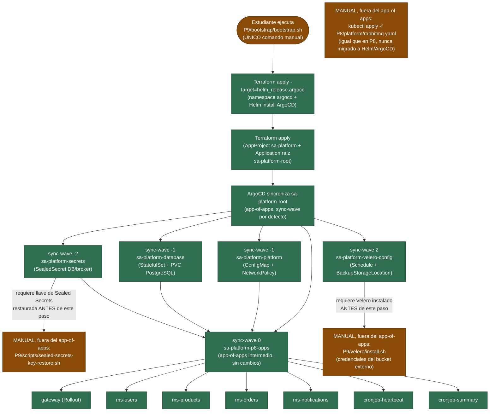

# Diagrama del bootstrap — proceso de recuperación (Práctica 9)

Este diagrama muestra el **orden de reconstrucción y las dependencias**
entre componentes al ejecutar `P9/bootstrap/bootstrap.sh` sobre un
clúster completamente destruido — no es un diagrama de arquitectura
general (ese ya existe en [P8/docs/gitops-flow.md](../../P8/docs/gitops-flow.md)).

## Qué se reconstruye automáticamente

Todo lo que cuelga de `sa-platform-root`: ArgoCD sincroniza la base de
datos, la plataforma compartida, los 7 componentes de P8 y la
configuración de Velero sin ningún `kubectl apply` manual, en el orden
que fijan los `sync-wave` (secretos → base de datos/plataforma →
servicios → configuración de Velero).

## Qué depende de respaldos

- **Datos de PostgreSQL**: el `PersistentVolumeClaim` se recrea vacío;
  el contenido real solo vuelve si se ejecuta
  `P9/scripts/velero-restore.sh` contra un backup existente.

## Qué depende de secretos

- **`sa-platform-secrets`** (sync-wave `-2`): los `SealedSecret` del
  repositorio GitOps son ilegibles a menos que la llave privada del
  controller se haya restaurado primero (ver
  [P9/kubernetes/secrets/README.md](../kubernetes/secrets/README.md)).

## Qué pasos siguen siendo manuales (y por qué)

| Paso manual | Por qué no se automatizó con Terraform/ArgoCD |
|---|---|
| `P9/scripts/sealed-secrets-key-restore.sh` | Requiere el archivo de la llave privada, que nunca vive en git |
| `P9/velero/install.sh` | Requiere el archivo de credenciales del almacenamiento externo, que nunca vive en git |
| `kubectl apply -f P8/platform/rabbitmq.yaml` | Decisión ya tomada en P8 (ver `P8/platform/rabbitmq.yaml`, comentario de cabecera): infraestructura previa a la aplicación, fuera del flujo de las Applications; P9 no cambia esa decisión, solo la documenta explícitamente en este diagrama |

El punto de entrada único (`bootstrap.sh`) automatiza todo lo que puede
automatizarse sin exponer un secreto en el repositorio; los tres pasos
manuales de la tabla están documentados en el runbook
([P9/docs/runbook.md](runbook.md)) con el comando exacto de cada uno.
